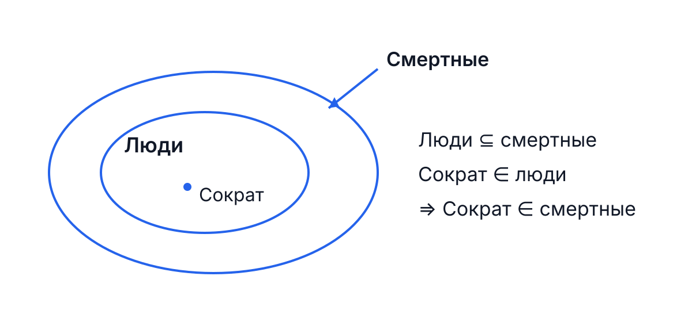
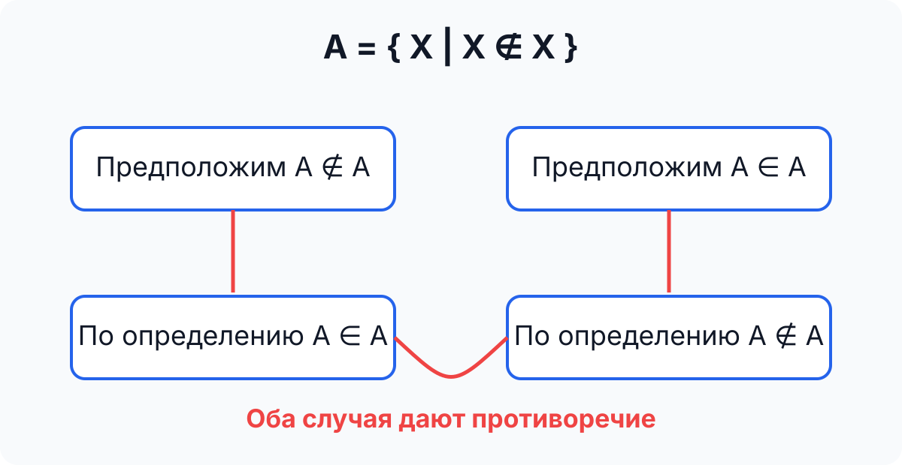
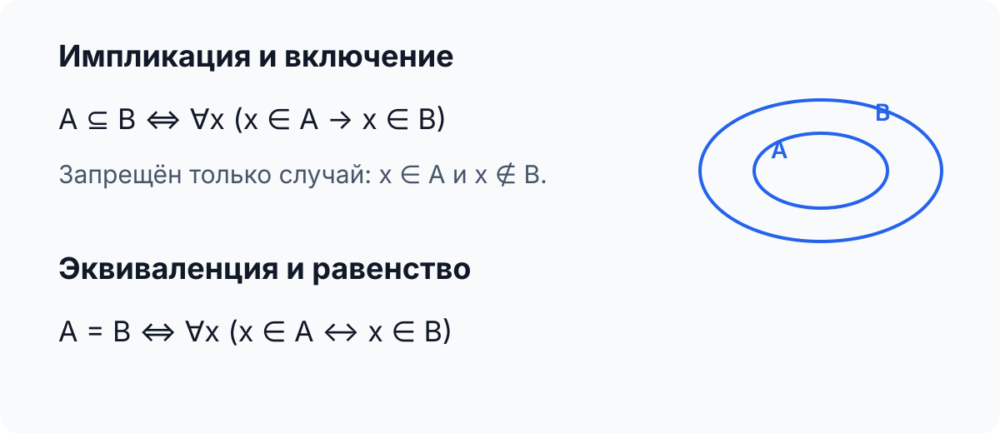

# Теория вероятностей — лекция 1
## Множества, парадокс Рассела и булева логика

Конспект сохранён **в порядке рукописи**. Здесь оставлено только основное из тетради, но короткие пояснения и доказательства дописаны там, где без них запись слишком сжата.

---

## Навигация по определениям

- [Множество](#def-set)
- [Парадокс Рассела](#def-russell)
- [Булева переменная](#def-bool-var)
- [Булева функция](#def-bool-func)
- [Тавтология](#def-tautology)
- [Противоречие](#def-contradiction)
- [Импликация](#def-implication)
- [Эквиваленция](#def-equivalence)
- [Законы дистрибутивности](#def-distributivity)
- [Контрапозиция](#def-contraposition)
- [Законы де Моргана](#def-demorgan)
- [Modus Ponens](#def-mp)

---

# 1. Множества

### Множество

**Множество** — совокупность объектов, рассматриваемая как единое целое.

Если объект $x$ принадлежит множеству $A$, пишут

$$
x\in A.
$$

Если не принадлежит,

$$
x\notin A.
$$

Если каждый элемент $A$ принадлежит $B$, то

$$
A\subseteq B.
$$

На лекции это иллюстрируется примером:

- Сократ — человек;
- множество людей содержится во множестве смертных;
- следовательно, Сократ смертен.

$$
\text{Сократ}\in\text{Люди},
\qquad
\text{Люди}\subseteq\text{Смертные}
\Rightarrow
\text{Сократ}\in\text{Смертные}.
$$

Используются кванторы

$$
\forall \text{ — «для всех»},
\qquad
\exists \text{ — «существует»}.
$$

---

# 2. Парадокс Рассела

### Парадокс Рассела

Рассмотрим множество

$$
\boxed{A=\{X\mid X\notin X\}.}
$$

То есть $A$ состоит из множеств, которые **не содержат сами себя**.

Проверим, может ли $A$ принадлежать самому себе.

### 1) Пусть $A\notin A$

Тогда $A$ удовлетворяет условию $X\notin X$, поэтому должно принадлежать $A$:

$$
A\notin A\Rightarrow A\in A.
$$

Противоречие.

### 2) Пусть $A\in A$

Но в $A$ входят только множества, не принадлежащие самим себе, значит

$$
A\in A\Rightarrow A\notin A.
$$

Снова противоречие.

Итак,

$$
\boxed{
A\notin A\Rightarrow A\in A,
\qquad
A\in A\Rightarrow A\notin A.
}
$$

В этом и состоит парадокс Рассела.

---

# 3. Истина, ложь и булевы переменные

Логические значения:

$$
1=\text{истина},
\qquad
0=\text{ложь}.
$$

### Булева переменная

**Булева переменная** принимает только значения $0$ и $1$:

$$
a\in\{0,1\}.
$$

Для $n$ переменных число наборов значений равно

$$
\boxed{2^n.}
$$

Например, для двух переменных:

$$
00,\quad01,\quad10,\quad11.
$$

### Булева функция

**Булева функция** от $n$ переменных задаёт значение $0$ или $1$ на каждом из $2^n$ наборов.

Поэтому число различных булевых функций равно

$$
\boxed{2^{2^n}.}
$$

Отсюда:

$$
n=1\Rightarrow4\text{ функции},
$$

$$
n=2\Rightarrow16\text{ функций},
$$

$$
n=3\Rightarrow256\text{ функций}.
$$

Для одной переменной:

| $x$ | $f_0$ | $f_1$ | $f_2$ | $f_3$ |
|---:|---:|---:|---:|---:|
| 0 | 0 | 0 | 1 | 1 |
| 1 | 0 | 1 | 0 | 1 |

Отсюда

$$
f_0\equiv0,
\qquad
f_3\equiv1.
$$

**Противоречие** — формула, всегда равная $0$.

**Тавтология** — формула, всегда равная $1$.

В рукописи также отмечен **плеоназм** как словесный аналог «скрытой тавтологии».

---

# 4. Основные логические операции

Для двух переменных используются операции:

- $-a$ или $\neg a$ — отрицание;
- $a\cdot b$ или $a\land b$ — конъюнкция;
- $a+b$ или $a\lor b$ — дизъюнкция;
- $a\oplus b$ — исключающее ИЛИ;
- $a\to b$ — импликация;
- $a\leftrightarrow b$ — эквиваленция.

**Импликация** $a\to b$ ложна только в случае $a=1$, $b=0$.

**Эквиваленция** $a\leftrightarrow b$ истинна тогда и только тогда, когда $a=b$.

### Таблица истинности

| $a$ | $b$ | $-a$ | $-b$ | $a\cdot b$ | $a\oplus b$ | $a+b$ | $a\to b$ | $a\leftrightarrow b$ |
|---:|---:|---:|---:|---:|---:|---:|---:|---:|
| 0 | 0 | 1 | 1 | 0 | 0 | 0 | 1 | 1 |
| 0 | 1 | 1 | 0 | 0 | 1 | 1 | 1 | 0 |
| 1 | 0 | 0 | 1 | 0 | 1 | 1 | 0 | 0 |
| 1 | 1 | 0 | 0 | 1 | 0 | 1 | 1 | 1 |

На лекции отдельно проверяется выражение

$$
a\cdot b+(-a).
$$

| $a$ | $b$ | $a\cdot b$ | $-a$ | $a\cdot b+(-a)$ |
|---:|---:|---:|---:|---:|
| 0 | 0 | 0 | 1 | 1 |
| 0 | 1 | 0 | 1 | 1 |
| 1 | 0 | 0 | 0 | 0 |
| 1 | 1 | 1 | 0 | 1 |

Последний столбец совпадает с импликацией, поэтому

$$
\boxed{a\cdot b+(-a)\equiv a\to b.}
$$

Также

$$
\boxed{a\to b\equiv(-a)+b.}
$$

---

# 5. Тавтология и противоречие

В рукописи проверяется

$$
\boxed{(-a)+a=1.}
$$

| $a$ | $-a$ | $(-a)+a$ |
|---:|---:|---:|
| 0 | 1 | 1 |
| 1 | 0 | 1 |

Следовательно,

$$
\boxed{(-a)+a\equiv1,}
$$

то есть это [тавтология](#def-tautology).

Если отрицать всю формулу, получим

$$
\boxed{-((-a)+a)\equiv0,}
$$

то есть [противоречие](#def-contradiction).

---

# 6. Импликация и отношения между множествами

В тетради записано соответствие

$$
A\to B\qquad(A\subseteq B).
$$

Смысл: если элемент принадлежит $A$, то при $A\subseteq B$ он обязан принадлежать и $B$:

$$
A\subseteq B
\iff
\forall x\,(x\in A\to x\in B).
$$

А равенство множеств соответствует эквиваленции:

$$
A=B
\iff
\forall x\,(x\in A\leftrightarrow x\in B).
$$

---

# 7. Законы дистрибутивности

### Первый закон

$$
\boxed{a\cdot(b+c)\equiv a\cdot b+a\cdot c.}
$$

Доказательство — сравнением двух столбцов таблицы истинности:

| $a$ | $b$ | $c$ | $a(b+c)$ | $ab+ac$ |
|---:|---:|---:|---:|---:|
| 0 | 0 | 0 | 0 | 0 |
| 0 | 0 | 1 | 0 | 0 |
| 0 | 1 | 0 | 0 | 0 |
| 0 | 1 | 1 | 0 | 0 |
| 1 | 0 | 0 | 0 | 0 |
| 1 | 0 | 1 | 1 | 1 |
| 1 | 1 | 0 | 1 | 1 |
| 1 | 1 | 1 | 1 | 1 |

Столбцы совпадают, значит закон доказан.

### Второй закон

$$
\boxed{a+b\cdot c\equiv(a+b)(a+c).}
$$

| $a$ | $b$ | $c$ | $a+bc$ | $(a+b)(a+c)$ |
|---:|---:|---:|---:|---:|
| 0 | 0 | 0 | 0 | 0 |
| 0 | 0 | 1 | 0 | 0 |
| 0 | 1 | 0 | 0 | 0 |
| 0 | 1 | 1 | 1 | 1 |
| 1 | 0 | 0 | 1 | 1 |
| 1 | 0 | 1 | 1 | 1 |
| 1 | 1 | 0 | 1 | 1 |
| 1 | 1 | 1 | 1 | 1 |

Столбцы также совпадают.

---

# 8. Закон контрапозиции

### Контрапозиция

$$
\boxed{a\to b\equiv(-b)\to(-a).}
$$

Проверка:

| $a$ | $b$ | $a\to b$ | $(-b)\to(-a)$ |
|---:|---:|---:|---:|
| 0 | 0 | 1 | 1 |
| 0 | 1 | 1 | 1 |
| 1 | 0 | 0 | 0 |
| 1 | 1 | 1 | 1 |

Столбцы совпадают, поэтому формулы равносильны.

---

# 9. Законы де Моргана

### Законы де Моргана

$$
\boxed{-(a+b)\equiv(-a)(-b),}
$$

$$
\boxed{-(ab)\equiv(-a)+(-b).}
$$

Их смысл: при отрицании

- $\lor$ меняется на $\land$;
- $\land$ меняется на $\lor$;
- каждая переменная получает отрицание.

Короткая проверка:

| $a$ | $b$ | $-(a+b)$ | $(-a)(-b)$ | $-(ab)$ | $(-a)+(-b)$ |
|---:|---:|---:|---:|---:|---:|
| 0 | 0 | 1 | 1 | 1 | 1 |
| 0 | 1 | 0 | 0 | 1 | 1 |
| 1 | 0 | 0 | 0 | 1 | 1 |
| 1 | 1 | 0 | 0 | 0 | 0 |

Обобщение на $n$ переменных:

$$
-\left(\bigvee_{i=1}^{n}a_i\right)
\equiv
\bigwedge_{i=1}^{n}(-a_i),
$$

$$
-\left(\bigwedge_{i=1}^{n}a_i\right)
\equiv
\bigvee_{i=1}^{n}(-a_i).
$$

---

# 10. Операции с $0$ и $1$

В тетради выписаны четыре свойства:

$$
\boxed{a+1=1,}
$$

$$
\boxed{a+0=a,}
$$

$$
\boxed{a\cdot1=a,}
$$

$$
\boxed{a\cdot0=0.}
$$

Также

$$
A=1\Rightarrow -A=0.
$$

---

# 11. Modus Ponens

### Modus Ponens — правило вывода

Если истинны $A$ и $A\to B$, то истинно $B$:

$$
\frac{A,\quad A\to B}{B}.
$$

В виде одной формулы:

$$
\boxed{[A\cdot(A\to B)]\to B.}
$$

Проверим таблицей истинности:

| $A$ | $B$ | $A\to B$ | $A\cdot(A\to B)$ | $[A\cdot(A\to B)]\to B$ |
|---:|---:|---:|---:|---:|
| 0 | 0 | 1 | 0 | 1 |
| 0 | 1 | 1 | 0 | 1 |
| 1 | 0 | 0 | 0 | 1 |
| 1 | 1 | 1 | 1 | 1 |

Последний столбец всегда равен $1$, поэтому

$$
\boxed{[A\cdot(A\to B)]\to B\equiv1.}
$$

То есть Modus Ponens задаёт тавтологически верное правило вывода.

---

# Главное из лекции

$$
\boxed{\#\text{ наборов}=2^n,\qquad \#\text{ функций}=2^{2^n}}
$$

$$
\boxed{a\to b\equiv(-a)+b}
$$

$$
\boxed{(-a)+a\equiv1}
$$

$$
\boxed{a(b+c)\equiv ab+ac}
$$

$$
\boxed{a+bc\equiv(a+b)(a+c)}
$$

$$
\boxed{a\to b\equiv(-b)\to(-a)}
$$

$$
\boxed{-(a+b)\equiv(-a)(-b)}
$$

$$
\boxed{-(ab)\equiv(-a)+(-b)}
$$

$$
\boxed{[A(A\to B)]\to B\equiv1}
$$
