# Дискретная математика --- 1 семестр

Полный структурированный конспект по лекциям. Порядок тем, определения,
теоремы, следствия, доказательства и примеры сохранены по исходному
рукописному конспекту. Небольшие пояснения для связности помечены как
**Пояснение**.

## Содержание

1.  Бинарные отношения
2.  Элементы общей алгебры
3.  Теория чисел
4.  Теория графов

# 1. Бинарные отношения

## 1.1. Множества и операции

**Множество** --- совокупность некоторого количества элементов.
Используются множества
$\mathbb N,\mathbb Z,\mathbb Q,\mathbb R,\mathbb C$.

$B\subseteq A$ означает, что $B$ --- подмножество $A$.

$$A\cap B=\{x\mid x\in A\land x\in B\},\qquad
A\cup B=\{x\mid x\in A\lor x\in B\},$$

$$A\setminus B=\{x\in A\mid x\notin B\},\qquad
\overline A=U\setminus A.$$

$\varnothing$ --- пустое множество, $U$ --- универсальное множество.

Декартово произведение:

$$A\times B=\{(a,b)\mid a\in A,\ b\in B\}.$$

В общем случае $A\times B\ne B\times A$.


## 1.2. Бинарное отношение

**Бинарным отношением на $A$** называется любое подмножество
$\rho\subseteq A\times A$. Если $(a,b)\in\rho$, пишут $a\rho b$.

**$n$-арное отношение** на $A$ --- любое подмножество $A^n$.

Примеры: $A\times A$ --- универсальное отношение; $\varnothing$ ---
пустое; $\Delta_A=\{(a,a)\mid a\in A\}$ --- отношение равенства.

Для конечного $|A|=n$ существует $2^{n^2}$ бинарных отношений на $A$.

### Способы задания

1.  перечислением упорядоченных пар;
2.  матрицей $M_\rho=(m_{ij})$, где $m_{ij}=1$, если $(a_i,a_j)\in\rho$,
    иначе $0$;
3.  ориентированным графом.


## 1.3. Операции над отношениями

Определены $\rho_1\cap\rho_2$, $\rho_1\cup\rho_2$,
$\rho_1\setminus\rho_2$.

Композиция:

$$\rho_1\rho_2=\{(a,c)\mid\exists b:\ a\rho_1b\land b\rho_2c\}.$$

Обратное отношение:

$$\rho^{-1}=\{(b,a)\mid(a,b)\in\rho\}.$$

Дополнение: $\overline\rho=(A\times A)\setminus\rho$.

## 1.4. Свойства отношений

**Рефлексивность:** $\forall a\in A\ a\rho a$.

**Симметричность:** $a\rho b\Rightarrow b\rho a$.

**Антисимметричность:** $a\rho b\land b\rho a\Rightarrow a=b$.

**Транзитивность:** $a\rho b\land b\rho c\Rightarrow a\rho c$.

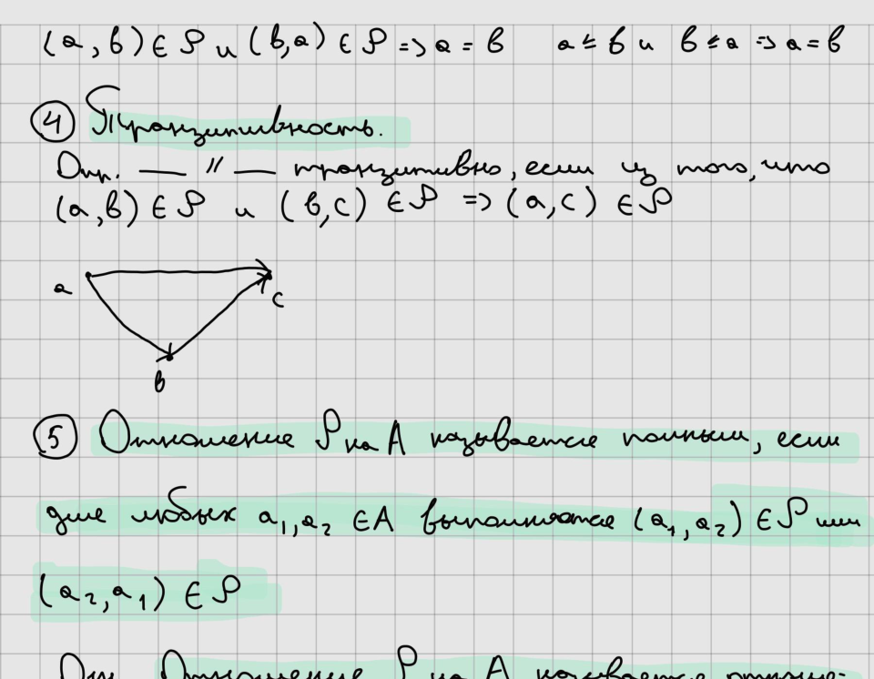

**Полнота:** для любых $a_1,a_2\in A$ выполняется $a_1\rho a_2$ или
$a_2\rho a_1$.

## 1.5. Эквивалентность

Отношение эквивалентности рефлексивно, симметрично и транзитивно.

Класс эквивалентности:

$$\overline a=[a]=\{b\in A\mid a\rho b\}.$$

**Теорема.** Если $\rho$ --- эквивалентность, то: 1. $a\in[a]$; 2.
$b\in[a]\Rightarrow[b]=[a]$; 3. классы либо совпадают, либо не
пересекаются; 4. классы эквивалентности образуют разбиение $A$.

## 1.6. Частичный порядок, грани, решётки

Частичный порядок --- рефлексивное, антисимметричное и транзитивное
отношение.

Для $Y\subseteq X$: - максимальный элемент --- над ним нет большего
элемента из $Y$; - минимальный --- под ним нет меньшего; - наибольший
$y$: $\forall x\in Y,\ x\le y$; - наименьший $y$:
$\forall x\in Y,\ y\le x$.

Верхняя грань $Y$ --- элемент $x$, для которого
$\forall y\in Y,\ y\le x$; нижняя грань определяется двойственно.
Наименьшая верхняя грань --- $\sup Y$, наибольшая нижняя --- $\inf Y$.

Если любые два элемента сравнимы, порядок линейный.

Верхняя полурешётка: для любых $a,b$ существует $a\vee b=\sup\{a,b\}$.
Нижняя: существует $a\wedge b=\inf\{a,b\}$. Если есть обе операции ---
это **решётка**.

Дистрибутивность:

$$(a\vee b)\wedge c=(a\wedge c)\vee(b\wedge c),$$
$$(a\wedge b)\vee c=(a\vee c)\wedge(b\vee c).$$

Дистрибутивная решётка с дополнениями --- **булева алгебра**.

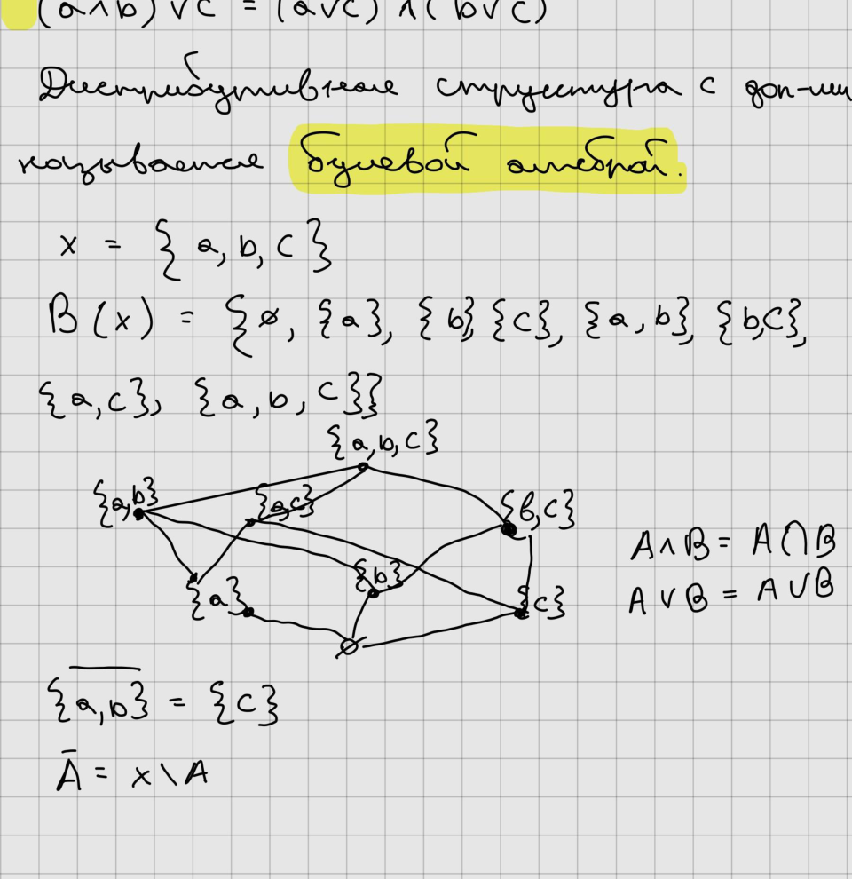

## 1.7. Отношения из множества в множество. Отображения

Отношение из $A$ в $B$ --- подмножество $\rho\subseteq A\times B$.

Образ $x\in A$: $x\rho=\{y\in B\mid(x,y)\in\rho\}$. Прообраз $y\in B$:
$y\rho^{-1}=\{x\in A\mid(x,y)\in\rho\}$.

Всюду определённое однозначное отношение --- отображение $f:A\to B$.

-   инъекция: $a_1\ne a_2\Rightarrow f(a_1)\ne f(a_2)$;
-   сюръекция: $\forall b\in B\ \exists a\in A:f(a)=b$;
-   биекция: одновременно инъекция и сюръекция.

Для конечных множеств одинаковой мощности инъективность эквивалентна
сюръективности.

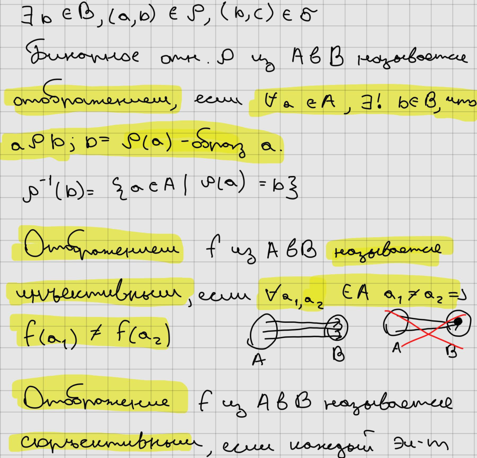

# 2. Элементы общей алгебры

## 2.1. Алгебраические структуры

Бинарная операция на $G$ --- отображение $*:G\times G\to G$. Пара
$(G,*)$ называется **группоидом**.

Для конечного множества операция может задаваться таблицей Кэли.

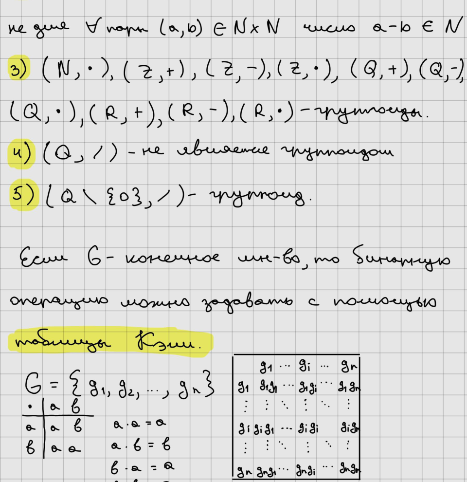

Правый единичный элемент: $ae=a$. Левый: $ea=a$. Если выполняются оба
условия --- единица.

**Лемма.** Правая и левая единицы, если обе существуют, совпадают:
$e_1=e_2e_1=e_2$.

Правый нуль: $a0=0$, левый: $0a=0$.

Группоид с ассоциативной операцией называется **полугруппой**.
Полугруппа с единицей --- **моноид**.

## 2.2. Группы

$(G,*)$ --- группа, если: 1. $(ab)c=a(bc)$; 2. существует $e$:
$ae=ea=a$; 3. для каждого $a$ существует $a^{-1}$: $aa^{-1}=a^{-1}a=e$.

$|G|$ --- порядок конечной группы.

В группе действуют законы сокращения:
$$ab=ac\Rightarrow b=c,\qquad ba=ca\Rightarrow b=c.$$

Обратный элемент единственен.

Если $ab=ba$ для всех $a,b$, группа называется **абелевой**.

## 2.3. Подгруппы

Непустое $H\subseteq G$ --- подгруппа, если оно замкнуто относительно
операции и взятия обратного элемента. Обозначение $H\le G$.

$\{e\}$ и $G$ --- подгруппы любой группы $G$.

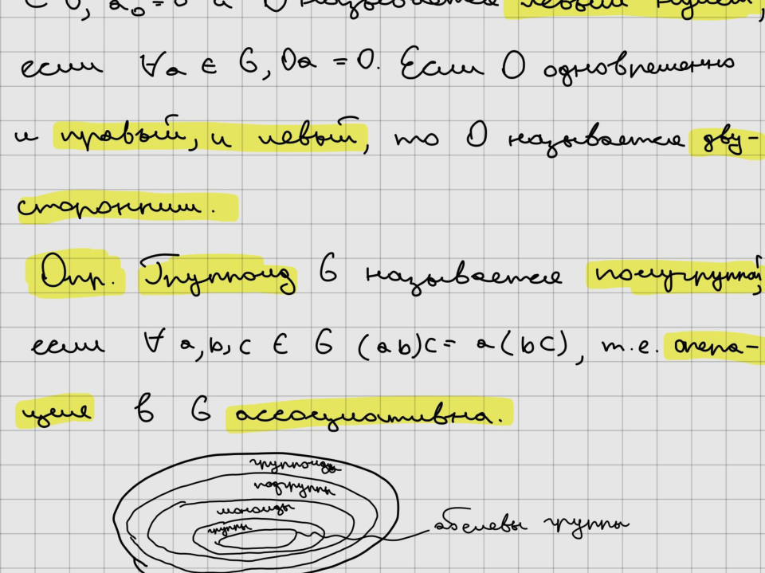

В аддитивной группе $\mathbb Z$ подгруппы имеют вид $n\mathbb Z$.

В группе симметрий треугольника $D_3$ среди подгрупп есть единичная,
подгруппы отражений и подгруппа вращений.

## 2.4. Смежные классы. Теорема Лагранжа

Пусть $H\le G$, $g\in G$. Множество

$$Hg=\{hg\mid h\in H\}$$

называется правым смежным классом $H$ по $g$.

**Лемма.** Два правых смежных класса либо совпадают, либо не
пересекаются; объединение всех классов равно $G$.

Для конечной $G$ число $|G|/|H|$ называется **индексом** $H$ в $G$ и
обозначается $(G:H)$.

**Теорема Лагранжа.** $$|G|=|H|\,(G:H).$$

Следовательно, порядок подгруппы делит порядок конечной группы.

## 2.5. Циклические группы

**Порядок элемента** $a\in G$ --- наименьшее натуральное $n$, для
которого $a^n=e$. Если такого $n$ нет, порядок бесконечен.

Если $|a|=n$, то $$a^m=e\Longleftrightarrow n\mid m.$$

Группа называется **циклической**, если существует $a\in G$, такой что
каждый элемент группы является степенью $a$: $$G=\langle a\rangle.$$

Если $G=\langle a\rangle$ и $|G|=n$, то
$$G=\{e,a,\ldots,a^{n-1}\},\qquad |a|=n.$$

Любая подгруппа циклической группы циклична. Все бесконечные циклические
группы изоморфны $(\mathbb Z,+)$.

Гомоморфизм групп $\varphi:G\to G_1$ сохраняет операцию:
$$\varphi(ab)=\varphi(a)\varphi(b).$$ Биективный гомоморфизм ---
изоморфизм.

## 2.6. Кольца и поля

**Кольцо** $R$ --- множество с операциями $+$ и $\cdot$, где: 1. $(R,+)$
--- абелева группа; 2. умножение ассоциативно; 3. выполняются
дистрибутивные законы: $$(a+b)c=ac+bc,\qquad a(b+c)=ab+ac.$$

Кольцо может дополнительно иметь единицу и/или коммутативное умножение.

Если коммутативное кольцо с единицей имеет обратный элемент для каждого
ненулевого элемента, оно называется **полем**.

**Делитель нуля** --- ненулевой элемент $a$, для которого существует
ненулевой $b$ с $ab=0$.

В поле делителей нуля нет.

## 2.7. Линейное пространство над произвольным полем

Линейное пространство $L$ над полем $F$ --- множество с операцией
сложения векторов и умножения вектора на скаляр, удовлетворяющее обычным
аксиомам линейного пространства.

В частности: $$a+x=b+x\Rightarrow a=b,\qquad 0a=\vec0,\qquad
\lambda\vec0=\vec0,$$
$$\lambda x=\vec0\Rightarrow \lambda=0\ \text{или}\ x=\vec0.$$

# 3. Теория чисел

## 3.1. Простые числа и делимость

Натуральное число $p>1$ называется **простым**, если его положительные
делители --- только $1$ и $p$. В противном случае число составное.

**Теорема.** Простых чисел бесконечно много.

### Деление с остатком

Для любых целых $a,b$, $b>0$, существуют единственные $q,r$:
$$a=bq+r,\qquad 0\le r<b.$$

### Основная теорема арифметики

Любое натуральное $n>1$ единственным образом, с точностью до
перестановки множителей, представляется как произведение простых:
$$n=p_1^{\alpha_1}\cdots p_k^{\alpha_k}.$$

## 3.2. НОД и алгоритм Евклида

$d$ называется общим делителем $a,b$, если $d\mid a$ и $d\mid b$.
Наибольший положительный общий делитель обозначается $\gcd(a,b)$.

**Лемма.** Если $a=bq+r$, то $$\gcd(a,b)=\gcd(b,r).$$

Отсюда получается **алгоритм Евклида**: $$a=bq_1+r_1,$$
$$b=r_1q_2+r_2,$$ $$r_1=r_2q_3+r_3,$$ $$\ldots$$ Последний ненулевой
остаток равен $\gcd(a,b)$.

Пример из конспекта: $$\gcd(134,58)=2.$$

### Расширенный алгоритм Евклида

**Теорема Безу.** Для любых $a,b$, не равных одновременно нулю,
существуют $u,v\in\mathbb Z$: $$au+bv=\gcd(a,b).$$

В конспекте для чисел $1729$ и $1547$ получено $\gcd=91$ и коэффициенты
Безу.

## 3.3. Взаимно простые числа

$a$ и $b$ взаимно просты, если $\gcd(a,b)=1$.

Эквивалентно: $$\exists u,v\in\mathbb Z:\ au+bv=1.$$

Полезные свойства: - если $a\mid c$, $b\mid c$ и $\gcd(a,b)=1$, то
$ab\mid c$; - если $a\mid bc$ и $\gcd(a,b)=1$, то $a\mid c$.

## 3.4. Сравнения по модулю

Для $n\in\mathbb N$: $$a\equiv b\pmod n$$ тогда и только тогда, когда
$n\mid(a-b)$.

Класс вычетов: $$\overline a=a+n\mathbb Z.$$

Сравнение по модулю $n$ является отношением эквивалентности на
$\mathbb Z$. Фактор-множество:
$$\mathbb Z/n\mathbb Z=\{\overline0,\overline1,\ldots,\overline{n-1}\}.$$

Операции: $$\overline a+\overline b=\overline{a+b},\qquad
\overline a\,\overline b=\overline{ab}.$$

$\mathbb Z/n\mathbb Z$ --- коммутативное ассоциативное кольцо с
единицей.

**Теорема.** $\overline a$ обратим в $\mathbb Z/n\mathbb Z$ тогда и
только тогда, когда $\gcd(a,n)=1$.

## 3.5. Функция Эйлера

$\varphi(n)$ --- число натуральных чисел, меньших $n$ и взаимно простых
с $n$.

Примеры: $$\varphi(5)=4,\qquad\varphi(6)=2,\qquad\varphi(8)=4.$$

**Теорема Эйлера.** Если $\gcd(a,n)=1$, то
$$a^{\varphi(n)}\equiv1\pmod n.$$

Функция Эйлера мультипликативна для взаимно простых аргументов:
$$\gcd(a,b)=1\Rightarrow\varphi(ab)=\varphi(a)\varphi(b).$$

Для простого $p$: $$\varphi(p)=p-1.$$

Для степени простого: $$\varphi(p^n)=p^{n-1}(p-1).$$

## 3.6. Китайская теорема об остатках

Рассмотрим систему $$
\begin{cases}
x\equiv x_1\pmod{n_1},\\
x\equiv x_2\pmod{n_2},\\
\cdots\\
x\equiv x_k\pmod{n_k},
\end{cases}
$$ где $n_i$ попарно взаимно просты.

Пусть $$N=n_1n_2\cdots n_k,\qquad m_i=\frac N{n_i}.$$

Выберем $y_i$ так, чтобы $$m_i y_i\equiv1\pmod{n_i}.$$

Тогда $$x_0=m_1y_1x_1+\cdots+m_ky_kx_k$$ --- решение системы, а все
решения имеют вид $$x=x_0+Nz,\qquad z\in\mathbb Z.$$

**Обобщение.** Для произвольных модулей система совместна тогда и только
тогда, когда $$x_i\equiv x_j\pmod{\gcd(n_i,n_j)}$$ для всех $i,j$. При
совместности решения определены по модулю
$\operatorname{lcm}(n_1,\ldots,n_k)$.

## 3.7. Элементарная теория многочленов

$F[x]$ --- кольцо многочленов над полем $F$. Оно коммутативно,
ассоциативно и имеет единицу.

Ненулевой $f(x)\in F[x]$ называется **неприводимым над $F$**, если его
нельзя представить как произведение двух многочленов положительной
степени, меньшей $\deg f$.

**Теорема.** Если $F$ --- конечное поле, то неприводимых многочленов над
$F$ бесконечно много.

### Деление многочленов

Для $f(x),g(x)\in F[x]$, $g(x)\ne0$, существуют единственные
$q(x),r(x)$: $$f(x)=g(x)q(x)+r(x),\qquad \deg r<\deg g.$$

### Разложение на неприводимые множители

Каждый многочлен степени $\ge1$ представляется произведением
неприводимых многочленов и скаляра; разложение единственно с точностью
до порядка и умножения множителей на ненулевые константы.

### Теорема Безу для многочленов

Если $a\in F$, то
$$f(x)\ \text{делится на}\ (x-a)\Longleftrightarrow f(a)=0.$$

Следствие: если $\deg f=n$, то у ненулевого $f$ не более $n$ корней в
$F$.

Если $\deg f=2$ или $3$, то $f$ неприводим над $F$ тогда и только тогда,
когда не имеет корней в $F$.

# 4. Теория графов

## 4.1. Основные определения

Пусть $V$ --- непустое конечное множество вершин. Через $V^{(2)}$
обозначим множество всех двухэлементных подмножеств $V$.

**Обыкновенный граф**: $$G=(V,E),\qquad E\subseteq V^{(2)}.$$

Элементы $V$ --- вершины, элементы $E$ --- рёбра.

Две вершины, соединённые ребром, называются **смежными**. Рёбра с общей
вершиной также называют смежными. Вершина и инцидентное ей ребро
называются **инцидентными**.

В более общем случае допускаются петли и кратные рёбра --- получается
**мультиграф**.


### Изоморфизм

Биективное отображение $\psi:V_1\to V_2$ --- изоморфизм $G_1$ на $G_2$,
если смежность сохраняется в обе стороны.

$$G_1\cong G_2$$

означает, что графы изоморфны.

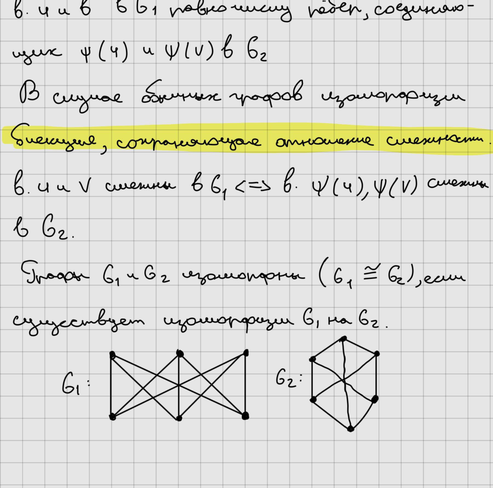

## 4.2. Степени вершин

**Степень вершины** $v$ --- число рёбер, инцидентных $v$, обозначается
$\deg v$.

В мультиграфе петля учитывается дважды.

-   $\deg v=0$ --- изолированная вершина;
-   $\deg v=1$ --- висячая вершина.

**Лемма о рукопожатиях:** $$\sum_{v\in V(G)}\deg v=2|E(G)|.$$

Следствие: число вершин нечётной степени чётно.

Граф называется **однородным** (регулярным), если все вершины имеют
одинаковую степень.

## 4.3. Специальные графы

**Нулевой граф** --- граф без рёбер. Обозначение $O_n$.

**Полный граф** --- простой граф, в котором любые две различные вершины
смежны. Обозначение $K_n$.

Число рёбер: $$|E(K_n)|=\frac{n(n-1)}2.$$

**Двудольный граф**: $V=X\sqcup Y$, каждое ребро соединяет вершину из
$X$ с вершиной из $Y$.

Полный двудольный граф обозначается $K_{p,q}$.

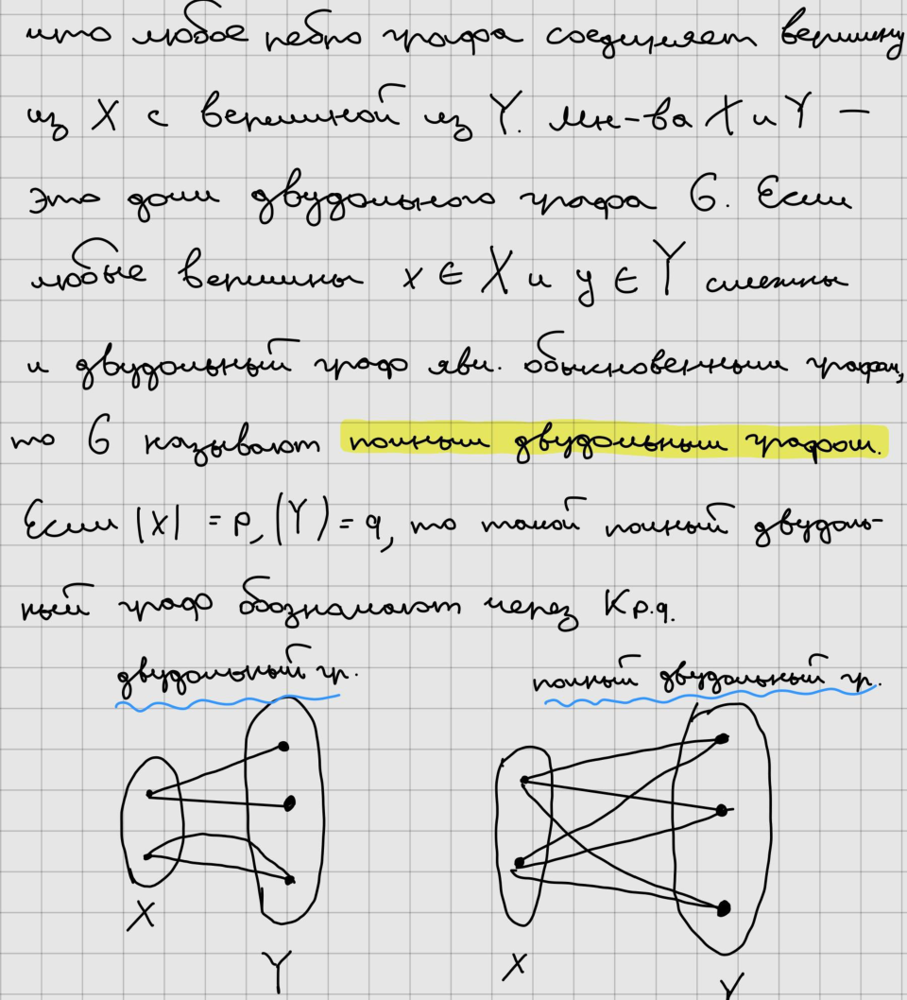

## 4.4. Подграфы

$H$ --- подграф $G$, если
$$V(H)\subseteq V(G),\qquad E(H)\subseteq E(G).$$

Если $V(H)=V(G)$, подграф называется **остовным**.

Удаление вершины $v$: $H-v$ --- подграф без $v$ и всех инцидентных ей
рёбер.

Удаление ребра $e$: $H-e$.

Добавление ребра: $H+e$.

Для $U\subseteq V(G)$ граф $G(U)$, содержащий вершины $U$ и все рёбра
исходного графа между ними, называется **подграфом, порождённым
множеством вершин $U$**.

На множестве подграфов можно рассматривать включение, объединение и
пересечение.

Если $H_1,\ldots,H_t$ попарно не имеют общих вершин, их объединение
называют **дизъюнктным объединением**.

## 4.5. Маршруты, цепи и циклы

**Маршрут** --- чередующаяся последовательность вершин и рёбер
$$v_0,e_1,v_1,\ldots,e_t,v_t,$$ где $e_i=v_{i-1}v_i$.

$(v_0,v_t)$-маршрут соединяет $v_0$ и $v_t$. Если $v_0=v_t$, маршрут
замкнут.

Длина маршрута --- число рёбер.

**Цепь** --- маршрут без повторяющихся рёбер.

**Простая цепь** --- цепь без повторяющихся вершин.

Замкнутая простая цепь называется **циклом**.

**Лемма.** Если существует $(u,v)$-маршрут, то существует и простая
$(u,v)$-цепь.

## 4.6. Связность

Граф называется **связным**, если для любых двух вершин существует
соединяющий их маршрут.

Связность вершин задаёт отношение эквивалентности. Классы
эквивалентности называются **компонентами связности**.

Связный граф имеет одну компоненту связности.

### Разрезы, мосты, точки сочленения

Разрезающее множество рёбер --- множество, удаление которого увеличивает
число компонент связности. Минимальное такое множество --- **разрез**.

**Мост** --- ребро, удаление которого увеличивает число компонент
связности.


Ребро является мостом тогда и только тогда, когда оно не принадлежит ни
одному циклу.

**Точка сочленения** --- вершина, удаление которой увеличивает число
компонент связности.

Для связного $(n,m,k)$-графа в конспекте приведена оценка:
$$n-k\le m\le\frac{(n-k)(n-k+1)}2.$$

## 4.7. Ориентированные графы

Пусть $V\ne\varnothing$, $D\subseteq V^2$. **Орграф**:
$$G=(V,D,\varphi),$$ где элементы $D$ --- дуги.

Для дуги $f$ задаются начало и конец. Петля имеет совпадающие начало и
конец.

Орграф удобно изображать стрелками.

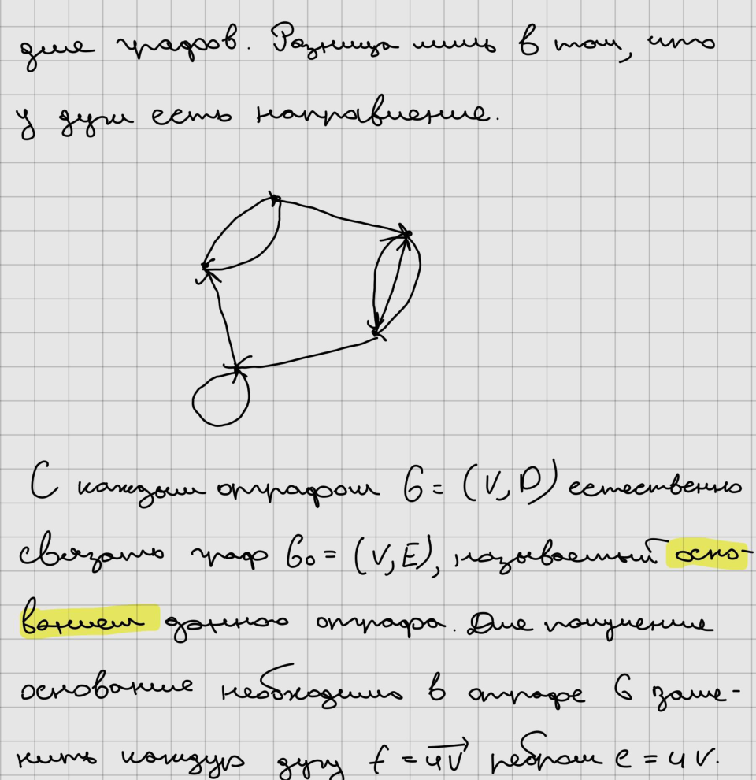

Связный граф, полученный из орграфа заменой каждой дуги обычным ребром,
называется основанием орграфа. Если основание связно, орграф называется
связным.

**Ориентированный маршрут** --- последовательность, в которой каждая
дуга проходится в своём направлении.

Замкнутый ориентированный маршрут без повторяющихся дуг ---
**ориентированный цикл**.

Вершина $v$ достижима из $u$, если существует $(u,v)$-ориентированный
маршрут.

Орграф **сильно связен**, если каждая вершина достижима из любой другой.

### Полустепени

Полустепень исхода $\deg^+v$ --- число дуг, выходящих из $v$.

Полустепень захода $\deg^-v$ --- число дуг, входящих в $v$.

Для $(n,m)$-орграфа: $$\sum_v\deg^+v=\sum_v\deg^-v=m.$$

## 4.8. Матрицы графа

### Матрица смежности

Для графа с вершинами $v_1,\ldots,v_n$: $$A(G)=(a_{ij})_{n\times n},$$
где $a_{ij}$ --- число рёбер, соединяющих $v_i$ и $v_j$.

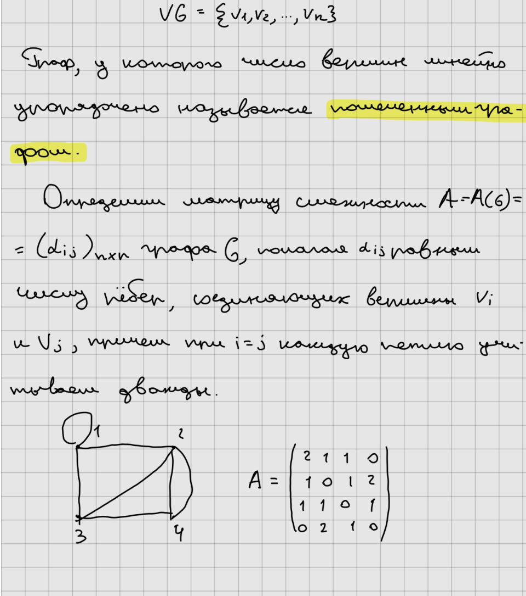

Для обыкновенного графа матрица симметрична, главная диагональ состоит
из нулей.

Для орграфа $a_{ij}$ --- число дуг из $v_i$ в $v_j$.

### Матрица инцидентности

Пусть $e_1,\ldots,e_m$ --- рёбра: $$B(G)=(b_{ij})_{n\times m},$$ где
$b_{ij}$ показывает инцидентность вершины $v_i$ ребру $e_j$.


Для ориентированного графа используется знаковая матрица: один конец
дуги отмечается $-1$, другой $+1$.

### Матрица Кирхгофа

$$L(G)=D(G)-A(G),$$ где $D(G)$ --- диагональная матрица степеней.

В конспекте также приводится матричная теорема о деревьях: число
остовных деревьев связано с определителем минора матрицы Кирхгофа.

## 4.9. Деревья, леса и остовы

Ациклический граф называется **лесом**. Связный ациклический граф ---
**дерево**.

Для $(n,m)$-графа следующие условия эквивалентны:

1.  $G$ --- дерево;
2.  $G$ связен и $m=n-1$;
3.  $G$ ацикличен и $m=n-1$;
4.  любые две вершины соединены единственной простой цепью;
5.  $G$ ацикличен, но добавление любого нового ребра создаёт ровно один
    цикл.

Следствие: каждое нетривиальное дерево имеет как минимум две висячие
вершины.

Если $G$ имеет $k$ компонент связности, то для леса $$m=n-k.$$

### Остовное дерево

Остовное дерево связного графа --- его остовный подграф, являющийся
деревом.

Удаляя по одному ребру из циклов связного графа, можно получить остовное
дерево.

Для $(n,m,k)$-графа величина $$\nu^*(G)=m-n+k$$ называется
**цикломатическим числом**. Величина $$\nu(G)=n-k$$ --- рангом графа.

Граф ацикличен тогда и только тогда, когда $\nu^*(G)=0$.

Любой ациклический подграф содержится в некотором остове.

## 4.10. Поиск в глубину (DFS)

Идея DFS: начинаем с непросмотренной вершины $u$ и идём по ребру в ещё
непросмотренную вершину $w$. Вершина $u$ становится родителем $w$. Если
у текущей вершины не осталось непросмотренных соседей, возвращаемся к
родителю.

Для хранения состояния используются: - `num[v]` --- номер посещения
вершины; - `father[v]` --- родитель; - $T$ --- множество древесных
рёбер; - $B$ --- множество обратных рёбер.

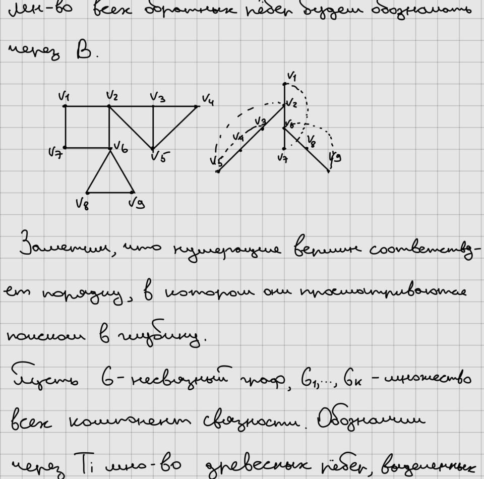

Псевдокод из конспекта:

``` text
procedure DFS(v)
begin
    num[v] := i; i := i + 1;
    for u in list[v] do
        if num[u] = 0 then
        begin
            T := T ∪ {vu};
            father[u] := v;
            DFS(u)
        end
        else if num[u] < num[v] and u ≠ father[v] then
            B := B ∪ {vu}
end

i := 1; T := ∅; B := ∅;
for v in V do num[v] := 0;
for v in V do
    if num[v] = 0 then
    begin
        father[v] := ∅;
        DFS(v)
    end
```

Для связного $(n,m)$-графа DFS просматривает каждое ребро постоянное
число раз, поэтому сложность $O(n+m)$.

Древесные рёбра образуют дерево поиска. Для несвязного графа получается
**глубинный лес**.

В неориентированном графе каждое недревесное ребро соединяет вершину с
её предком в DFS-дереве.

## 4.11. Эйлеровы цепи

**Эйлерова цепь** содержит все рёбра графа и каждое ровно один раз.

Связный граф, имеющий замкнутую эйлерову цепь, называется **эйлеровым**.

**Теорема Эйлера.** Для связного неориентированного графа
эквивалентны: 1. граф эйлеров; 2. каждая вершина имеет чётную степень;
3. множество рёбер можно разложить на циклы.

Следствие: если связный граф имеет $2k$ вершин нечётной степени, его
рёбра можно разбить на $k$ цепей, каждая из которых соединяет две
нечётные вершины.

Граф называется **полуэйлеровым**, если существует открытая цепь,
содержащая все рёбра. Для связного графа это происходит при ровно двух
вершинах нечётной степени.

## 4.12. Гамильтоновы графы

**Гамильтонова цепь** проходит через каждую вершину графа ровно один
раз.

Граф называется **гамильтоновым**, если содержит гамильтонов цикл.

Пусть степени вершин упорядочены: $$d_1\le d_2\le\cdots\le d_n.$$

В конспекте приведены достаточные условия гамильтоновости.

### Теорема Хватала

Для обыкновенного графа с $n\ge3$: если для каждого $k<n/2$ из
$d_k\le k$ следует $d_{n-k}\ge n-k$, то граф гамильтонов.

### Следствия

Граф гамильтонов, если, например:

1.  $d_k\ge n/2$ для всех вершин;
2.  для любых двух несмежных вершин $u,v$: $$\deg u+\deg v\ge n;$$
3.  выполняется условие вида $d_k>k$ для соответствующего диапазона $k$.

### Ориентированные гамильтоновы графы

Гамильтоновым орграфом называется орграф с ориентированным гамильтоновым
циклом.

Полный орграф, в котором между каждой парой различных вершин выбрано
ровно одно направление, называется **турниром**.

В конспекте приведено достаточное условие: если для каждой вершины
полустепени входа и выхода достаточно велики (не меньше половины порядка
с округлением по условию теоремы), орграф гамильтонов.

## 4.13. Корневые и бинарные деревья

Дерево $T=(V,E)$ с фиксированной вершиной $r$ называется **корневым
деревом с корнем $r$**.

Для вершин вводится порядок: $u\le v$, если $v$ лежит на простой
$(r,u)$-цепи. Корень является наибольшим элементом этого порядка.

Если $v$ --- ближайшая к $u$ вершина на пути к корню, $v$ называется
**предком/родителем**, а $u$ --- **потомком/сыном** $v$.

Для вершины $v$ поддерево с корнем $v$ состоит из $v$ и всех её
потомков.

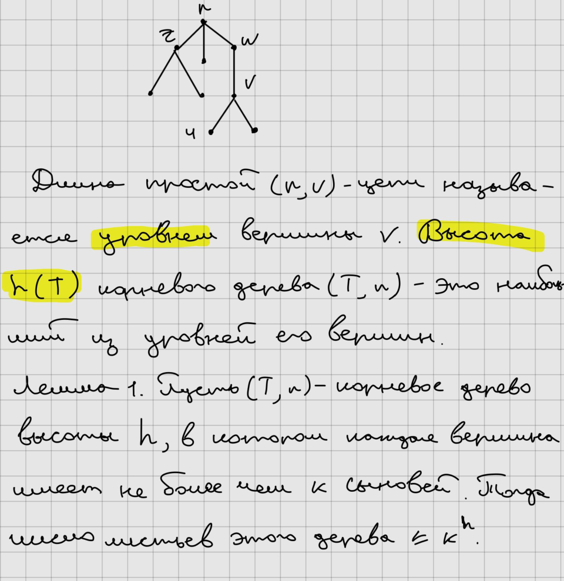

**Уровень вершины** --- длина пути от корня до этой вершины.

**Высота** $h(T)$ --- наибольший уровень вершины.

Если высота равна $h$ и каждая вершина имеет не более $k$ сыновей, то
число листьев не превосходит $k^h$.

### Бинарное дерево

Бинарное дерево --- корневое дерево, в котором каждая вершина имеет не
более двух сыновей.

Для каждой вершины различают левого и правого сына (`left(v)` и
`right(v)`).

------------------------------------------------------------------------

# Краткая карта курса

-   **Бинарные отношения:** множества → отношения → свойства →
    эквивалентность → порядок → решётки → отображения.
-   **Общая алгебра:** группоиды → полугруппы → группы → подгруппы →
    смежные классы → циклические группы → кольца и поля → линейные
    пространства.
-   **Теория чисел:** простые числа → НОД → Евклид → взаимная простота →
    сравнения → Эйлер → КТО → многочлены.
-   **Теория графов:** определения → степени → связность → орграфы →
    матрицы → деревья → DFS → Эйлеровы → Гамильтоновы → корневые
    деревья.

> **Пояснение.** Этот файл предназначен как читаемая цифровая версия
> исходных лекций. Исходный PDF остаётся первичным источником рукописных
> формулировок и рисунков; ключевые схемы выше вставлены непосредственно
> из него без перерисовки.
