# Линейная алгебра — 1 семестр

Полный конспект по **24 экзаменационным билетам**.

> Версия специально подготовлена для GitHub Markdown:
> - inline-формулы оформлены через `$...$`;
> - большие формулы — через блоки `math`;
> - рисунки подключены как SVG из папки `assets/linear-algebra-sem1/`;
> - запрещённые/нестабильные для GitHub макросы заменены на совместимые варианты.

## Содержание

1. [Билет 1. Свойства операций сложения и умножения комплексных чисел.](#ticket-1)
2. [Билет 2. Свойства комплексного сопряжения и обращения комплексных чисел.](#ticket-2)
3. [Билет 3. Функция e^z и её алгебраические свойства. Показательная форма записи комплексного числа; операции с комплексными числами в показательной форме записи.](#ticket-3)
4. [Билет 4. Свойства матричного умножения.](#ticket-4)
5. [Билет 5. Индуктивное определение детерминанта и непосредственные следствия из него: графические правила для вычисления определителей 2-го и 3-го порядков; определитель нижней треугольной матрицы.](#ticket-5)
6. [Билет 6. Понятие линейной зависимости применительно к матрицам-строкам. Лемма о линейной зависимости матриц-строк. Определитель с нулевой строкой, двумя равными строками и линейно зависимыми строками.](#ticket-6)
7. [Билет 7. Обратная матрица: единственность и условие существования. Формула для обращения матрицы.](#ticket-7)
8. [Билет 8. Теорема о правой обратной и левой обратной матрицах. Свойства операции обращения матриц.](#ticket-8)
9. [Билет 9. Формулы Крамера. Критерий существования ненулевого решения у ОСЛУ с квадратной матрицей.](#ticket-9)
10. [Билет 10. Координаты вектора, получающегося при сложении векторов и умножении вектора на число. Вычисление координат векторов в ОНБ; вычисление скалярного произведения через координаты сомножителей в ОНБ.](#ticket-10)
11. [Билет 11. Свойства векторного произведения: критерий коллинеарности векторов; геометрический смысл векторного произведения; формула для вычисления векторного произведения через координаты сомножителей в правом ОНБ.](#ticket-11)
12. [Билет 12. Свойства векторного произведения: формула «БАЦ минус ЦАБ», тождество Якоби.](#ticket-12)
13. [Билет 13. Свойства смешанного умножения: критерий компланарности; критерий правой и левой тройки; геометрический смысл смешанного произведения.](#ticket-13)
14. [Билет 14. Свойства смешанного умножения: формула для вычисления смешанного произведения через координаты сомножителей в правом ОНБ; различные перестановки сомножителей в смешанном произведении.](#ticket-14)
15. [Билет 15. Теорема об общем уравнении прямой на плоскости.](#ticket-15)
16. [Билет 16. Формула для расстояния от точки до прямой на плоскости; формула для расстояния между параллельными прямыми на плоскости.](#ticket-16)
17. [Билет 17. Каноническое уравнение эллипса.](#ticket-17)
18. [Билет 18. Каноническое уравнение гиперболы.](#ticket-18)
19. [Билет 19. Каноническое уравнение параболы.](#ticket-19)
20. [Билет 20. Аксиомы линейного пространства и непосредственные следствия из них.](#ticket-20)
21. [Билет 21. Теорема о преобразовании координат. Связь матриц перехода.](#ticket-21)
22. [Билет 22. Критерий подпространства. Свойства линейных оболочек.](#ticket-22)
23. [Билет 23. Сумма и пересечение подпространств. Критерий прямой суммы.](#ticket-23)
24. [Билет 24. Теорема о размерности суммы.](#ticket-24)

---

<a id="ticket-1"></a>

## Билет 1. Свойства операций сложения и умножения комплексных чисел.

### Определения из полной тетради

**Определение 1.** Множеством комплексных чисел называется множество $\mathbb R^2$, на котором определены операции сложения и умножения по следующим правилам:


```math
(x_1;y_1)+(x_2;y_2)=(x_1+x_2;\,y_1+y_2),
```


```math
(x_1;y_1)\cdot(x_2;y_2)=(x_1x_2-y_1y_2;\,x_1y_2+x_2y_1).
```


Любая упорядоченная пара $(x;y)\in\mathbb R^2$ в таком контексте называется **комплексным числом**; $x$ — вещественная часть, $y$ — мнимая часть. $\mathbb C$ — множество комплексных чисел.

**Определение 2.** Выражение вида $x+yi$ называется **алгебраической формой записи** комплексного числа $(x;y)\in\mathbb C$.

### Теорема 1 (св-ва «+» и «·» комплексных чисел)

1. $\forall z_1,z_2\in\mathbb C\quad z_1+z_2=z_2+z_1$ — коммутативность «+» комплексных чисел.
2. $\forall z_1,z_2,z_3\in\mathbb C\quad (z_1+z_2)+z_3=z_1+(z_2+z_3)$ — ассоциативность «+» комплексных чисел.
3. $\forall z_1,z_2\in\mathbb C\quad z_1\cdot z_2=z_2\cdot z_1$ — коммутативность «·» комплексных чисел.
4. $\forall z_1,z_2,z_3\in\mathbb C\quad (z_1\cdot z_2)\cdot z_3=z_1\cdot(z_2\cdot z_3)$ — ассоциативность «·» комплексных чисел.
5. $\forall z_1,z_2,z_3\in\mathbb C\quad (z_1+z_2)\cdot z_3=z_1\cdot z_3+z_2\cdot z_3$ — дистрибутивность «·» комплексных чисел относительно их сложения.

**Д-во:**

**1)** $z_1=x_1+y_1i,\ z_2=x_2+y_2i$, $(x_i,y_i\in\mathbb R)$.


```math
\begin{aligned}
z_1+z_2&=(x_1+y_1i)+(x_2+y_2i)=(x_1+x_2)+(y_1+y_2)i,\\
z_2+z_1&=(x_2+y_2i)+(x_1+y_1i)=(x_2+x_1)+(y_2+y_1)i.
\end{aligned}
```


```math
[\text{коммутативность вещественных чисел}]\Rightarrow
x_1+x_2=x_2+x_1,\quad (y_1+y_2)i=(y_2+y_1)i
\Rightarrow z_1+z_2=z_2+z_1.
```


**2)** $z_1=x_1+y_1i,\ z_2=x_2+y_2i,\ z_3=x_3+y_3i$.


```math
\begin{aligned}
(z_1+z_2)+z_3
&=((x_1+y_1i)+(x_2+y_2i))+(x_3+y_3i)\\
&=((x_1+x_2)+(y_1+y_2)i)+(x_3+y_3i)\\
&=((x_1+x_2)+x_3)+((y_1+y_2)+y_3)i\\
&=[\text{ассоциативность вещественных чисел}]\\
&=x_1+(x_2+x_3)+(y_1+(y_2+y_3))i\\
&=(x_1+y_1i)+((x_2+x_3)+(y_2+y_3)i)\\
&=z_1+(z_2+z_3).
\end{aligned}
```


**3)** $z_1=x_1+y_1i,\ z_2=x_2+y_2i$.


```math
\begin{aligned}
z_1z_2&=(x_1x_2-y_1y_2)+(x_1y_2+x_2y_1)i,\\
z_2z_1&=(x_2x_1-y_2y_1)+(x_2y_1+y_2x_1)i.
\end{aligned}
```


В силу коммутативности умножения и сложения вещественных чисел:


```math
x_1x_2=x_2x_1,\quad y_1y_2=y_2y_1,\quad x_1y_2+x_2y_1=x_2y_1+y_2x_1
\Rightarrow z_1z_2=z_2z_1.
```


**4)** $z_1=x_1+y_1i,\ z_2=x_2+y_2i,\ z_3=x_3+y_3i$.


```math
\begin{aligned}
(z_1z_2)z_3
&=((x_1x_2-y_1y_2)+(x_1y_2+x_2y_1)i)(x_3+y_3i)\\
&=(x_1x_2x_3-y_1y_2x_3-x_1y_2y_3-x_2y_1y_3)\\
&\quad +(x_1x_2y_3-y_1y_2y_3+x_1y_2x_3+x_2y_1x_3)i,
\end{aligned}
```


```math
\begin{aligned}
z_1(z_2z_3)
&=(x_1+y_1i)((x_2x_3-y_2y_3)+(x_2y_3+x_3y_2)i)\\
&=(x_1x_2x_3-x_1y_2y_3-y_1x_2y_3-y_1y_2x_3)\\
&\quad +(x_1x_2y_3+x_1x_3y_2+y_1x_2x_3-y_1y_2y_3)i.
\end{aligned}
```


В силу дистрибутивности «·» вещественных чисел относительно их «+» получаем одинаковые суммы, следовательно $(z_1z_2)z_3=z_1(z_2z_3)$. $\blacksquare$

**5)**


```math
\begin{aligned}
(z_1+z_2)z_3
&=((x_1+x_2)+(y_1+y_2)i)(x_3+y_3i)\\
&=(x_1x_3+x_2x_3-y_1y_3-y_2y_3)\\
&\quad +(x_1y_3+x_2y_3+y_1x_3+y_2x_3)i,
\end{aligned}
```


```math
\begin{aligned}
z_1z_3&=(x_1x_3-y_1y_3)+(x_1y_3+y_1x_3)i,\\
z_2z_3&=(x_2x_3-y_2y_3)+(x_2y_3+y_2x_3)i,\\
z_1z_3+z_2z_3
&=(x_1x_3+x_2x_3-y_1y_3-y_2y_3)\\
&\quad +(x_1y_3+y_1x_3+x_2y_3+y_2x_3)i.
\end{aligned}
```


```math
(z_1+z_2)z_3=z_1z_3+z_2z_3.\quad\blacksquare
```


[↑ К содержанию](#содержание)

---

<a id="ticket-2"></a>

## Билет 2. Свойства комплексного сопряжения и обращения комплексных чисел.

### Определения из полной тетради

**Определение 1.** Число, комплексно сопряжённое к $z=x+yi$, $(x,y\in\mathbb R)$, называется число


```math
\bar z=z^*=x-yi.
```


**Определение 2.** Число $\widetilde z$ называется **обратным** к $z$, если $\widetilde z\cdot z=1$.

Обозначение: $\widetilde z=z^{-1}$.

### Теорема 1 (св-ва $\bar z$)

1. $\forall z\in\mathbb C\quad \overline{\bar z}=z$.
2. $\forall z_1,z_2\in\mathbb C\quad \overline{z_1+z_2}=\bar z_1+\bar z_2$.
3. $\forall z_1,z_2\in\mathbb C\quad \overline{z_1z_2}=\bar z_1\bar z_2$.

**Д-во:**

**1)** $z=x+yi,\ x,y\in\mathbb R$.


```math
\overline{\bar z}=\overline{(x-yi)}=x+yi=z.
```


**2)** $z_1=x_1+y_1i,\ z_2=x_2+y_2i,\ x_i,y_i\in\mathbb R$.


```math
\begin{aligned}
\overline{z_1+z_2}
&=\overline{(x_1+y_1i)+(x_2+y_2i)}\\
&=\overline{(x_1+x_2)+(y_1+y_2)i}\\
&=(x_1+x_2)-(y_1+y_2)i,
\end{aligned}
```


```math
\begin{aligned}
\bar z_1+\bar z_2
&=\overline{x_1+y_1i}+\overline{x_2+y_2i}\\
&=(x_1-y_1i)+(x_2-y_2i)\\
&=(x_1+x_2)-(y_1+y_2)i
=\overline{z_1+z_2}.
\end{aligned}
```


**3)** $z_1=x_1+y_1i,\ z_2=x_2+y_2i$, $(x_i,y_i\in\mathbb R)$.


```math
\begin{aligned}
\overline{z_1z_2}
&=\overline{(x_1+y_1i)(x_2+y_2i)}\\
&=\overline{(x_1x_2-y_1y_2)+(x_1y_2+y_1x_2)i}\\
&=(x_1x_2-y_1y_2)-(x_1y_2+y_1x_2)i,
\end{aligned}
```


```math
\begin{aligned}
\bar z_1\bar z_2
&=\overline{x_1+y_1i}\cdot\overline{x_2+y_2i}\\
&=(x_1-y_1i)(x_2-y_2i)\\
&=(x_1x_2-y_1y_2)-(x_1y_2+x_2y_1)i
=\overline{z_1z_2}.\quad\blacksquare
\end{aligned}
```


### Теорема 2 (св-ва $z^{-1}$)

1. Если для данного $z$ существует $z^{-1}$, то оно единственное.
2. $\exists z^{-1}\Longleftrightarrow z\ne0$. Для $z=x+yi\ne0$, $(x,y\in\mathbb R)$,
   

```math
z^{-1}=\frac{x}{x^2+y^2}-\frac{y}{x^2+y^2}i.
```


3. $(z^{-1})^{-1}=z$.
4. $(\bar z)^{-1}=\overline{(z^{-1})}$.
5. $(z_1z_2)^{-1}=z_1^{-1}z_2^{-1}$.

**Д-во:**

**1)** Пусть $(z^{-1})_1$ и $(z^{-1})_2$ — числа, обратные к $z$.


```math
\begin{aligned}
(z^{-1})_1z&=1\quad |\cdot(z^{-1})_2,\\
(z^{-1})_1(z^{-1})_2z&=(z^{-1})_2,\\
(z^{-1})_1((z^{-1})_2z)&=(z^{-1})_2,\\
(z^{-1})_1\cdot1&=(z^{-1})_2,\\
(z^{-1})_1&=(z^{-1})_2.
\end{aligned}
```


**2)** $(\Rightarrow)$ Пусть $\exists z^{-1}\Rightarrow z\cdot z^{-1}=1\Rightarrow z\ne0$.

$(\Leftarrow)$ Пусть $z\ne0$. Докажем, что $\dfrac{x}{x^2+y^2}-\dfrac{y}{x^2+y^2}i$ — обратное к $z$:


```math
(x+yi)\left(\frac{x}{x^2+y^2}-\frac{y}{x^2+y^2}i\right)
=\left(\frac{x^2}{x^2+y^2}+\frac{y^2}{x^2+y^2}\right)
+\left(-\frac{xy}{x^2+y^2}+\frac{xy}{x^2+y^2}\right)i
=1.
```


**3)**

```math
z\cdot z^{-1}=1\Rightarrow(z^{-1})^{-1}=z.
```


**4)**

```math
\bar z\cdot\overline{(z^{-1})}=\overline{z\cdot z^{-1}}=\bar1=1\Rightarrow(\bar z)^{-1}=\overline{(z^{-1})}.
```


**5)**

```math
(z_1z_2)(z_1^{-1}z_2^{-1})
=z_1(z_2z_2^{-1})z_1^{-1}
=(z_1\cdot1)z_1^{-1}
=z_1z_1^{-1}=1
\Rightarrow(z_1z_2)^{-1}=z_1^{-1}z_2^{-1}.\quad\blacksquare
```


[↑ К содержанию](#содержание)

---

<a id="ticket-3"></a>

## Билет 3. Функция $e^z$ и её алгебраические свойства. Показательная форма записи комплексного числа; операции с комплексными числами в показательной форме записи.

### Определения из полной тетради

Для $z=x+yi$, $(x,y\in\mathbb R)$,


```math
|z|=\sqrt{x^2+y^2}.
```


$\varphi=\mathrm{Arg}(z)$ — аргумент $z$, определённый с точностью до $+2\pi k$, $k\in\mathbb Z$. Значение $\mathrm{Arg}(z)$, лежащее в $(-\pi;\pi]$, называется главным значением аргумента и обозначается $\arg(z)$.

**Определение 1.** Число, комплексно сопряжённое к $z=x+yi$, $(x,y\in\mathbb R)$, называется число $\bar z=z^*=x-yi$.


<p align="center">
  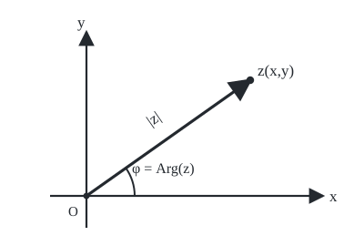
</p>

<p align="center"><em>Геометрический смысл модуля и аргумента комплексного числа</em></p>


### Теорема 1 (св-ва $e^z$)

1. $\forall z_1,z_2\in\mathbb C\quad e^{z_1}\cdot e^{z_2}=e^{z_1+z_2}$.
2. $\forall z\in\mathbb C\quad \overline{(e^z)}=e^{\bar z}$.

**Д-во:**

**1)** $z_1=x_1+y_1i,\ z_2=x_2+y_2i$, $(x_i,y_i\in\mathbb R)$.


```math
\begin{aligned}
e^{z_1}e^{z_2}
&=e^{x_1+y_1i}e^{x_2+y_2i}\\
&=e^{x_1}(\cos y_1+i\sin y_1)e^{x_2}(\cos y_2+i\sin y_2)\\
&=e^{x_1+x_2}\big((\cos y_1\cos y_2-\sin y_1\sin y_2)\\
&\qquad +(\cos y_1\sin y_2+\sin y_1\cos y_2)i\big)\\
&=e^{x_1+x_2}(\cos(y_1+y_2)+\sin(y_1+y_2)i)\\
&=e^{(x_1+x_2)+(y_1+y_2)i}=e^{z_1+z_2}.
\end{aligned}
```


**2)** $z=x+yi$, $(x,y\in\mathbb R)$.


```math
\begin{aligned}
\overline{(e^z)}
&=\overline{e^{x+yi}}
=\overline{e^x(\cos y+i\sin y)}\\
&=e^x(\cos y-i\sin y)
=e^x(\cos(-y)+i\sin(-y))\\
&=e^{x+i(-y)}=e^{x-yi}=e^{\bar z}.\quad\blacksquare
\end{aligned}
```


### Следствие

**1)** $\forall z\in\mathbb C\quad (e^z)^{-1}=e^{-z}$.


```math
e^z\cdot e^{-z}=e^{z+(-z)}=e^0=1\Rightarrow(e^z)^{-1}=e^{-z}.
```


**2) Показательная форма записи $z\ne0$:**


```math
z=|z|e^{i\mathrm{Arg}(z)}.
```


**Д-во:**


```math
z=|z|(\cos(\mathrm{Arg}(z))+i\sin(\mathrm{Arg}(z)))
=|z|e^{i\mathrm{Arg}(z)}.
```


**3)** $\forall z_1\ne0,\ z_2\ne0$


```math
z_1z_2=|z_1||z_2|e^{(\mathrm{Arg}(z_1)+\mathrm{Arg}(z_2))i}.
```


**Д-во:**


```math
z_1z_2=|z_1|e^{\mathrm{Arg}(z_1)i}\cdot|z_2|e^{\mathrm{Arg}(z_2)i}
=|z_1||z_2|e^{(\mathrm{Arg}(z_1)+\mathrm{Arg}(z_2))i}.
```


**4)** $\forall z\ne0$


```math
\bar z=|z|e^{-\mathrm{Arg}(z)i}.
```


**Д-во:**


```math
\bar z=\overline{|z|e^{\mathrm{Arg}(z)i}}
=|z|\,\overline{e^{\mathrm{Arg}(z)i}}
=|z|e^{-\mathrm{Arg}(z)i}.
```


### Формула для извлечения корней

Пусть $z\ne0$:


```math
(\sqrt[n]{z})_k=\sqrt[n]{|z|}\,e^{\frac{\mathrm{Arg}(z)+2\pi k}{n}i},
\qquad k\in\{0,1,\ldots,n-1\}.
```


[↑ К содержанию](#содержание)

---

<a id="ticket-4"></a>

## Билет 4. Свойства матричного умножения.

### Определения из полной тетради

**Определение 1.** Пусть $m,n\in\mathbb N$. Матрицей размерности $m\times n$ над полем $P$, или $m\times n$-матрицей над полем $P$, называется функция, которая каждой упорядоченной паре чисел $(i;j)$, $i\in\{1,2,\ldots,m\}$, $j\in\{1,2,\ldots,n\}$, ставит в соответствие число из $P$.

**Определение 2.** Суммой матриц $A_{m\times n}$ и $B_{m\times n}$ называется такая матрица $C_{m\times n}$, что $\forall i\in\{1,2,\ldots,m\}$ и $\forall j\in\{1,2,\ldots,n\}$ $c_{ij}=a_{ij}+b_{ij}$. Обозначение: $C=A+B$.

Матрицы $A_{m\times n}$ и $B_{p\times q}$ называются **равными**, если $m=p$, $n=q$ и $a_{ij}=b_{ij}$ для всех допустимых $i,j$.

**Определение 3.** Произведением матриц $A_{m\times n}$ и $B_{n\times p}$ называется такая матрица $C_{m\times p}$, что


```math
c_{ik}=\sum_{j=1}^{n}a_{ij}b_{jk}=a_{i1}b_{1k}+a_{i2}b_{2k}+\cdots+a_{in}b_{nk}.
```


$E_{n\times n}$ — единичная матрица; $O_{m\times n}$ — нулевая матрица.

### Теорема 1 (св-ва умножения матриц)

1. Матричное умножение не коммутативно.
2. $\forall A_{m\times n},\ B_{n\times p},\ C_{p\times q}\quad (AB)C=A(BC)$.
3. $\forall A_{m\times n},\ B_{n\times p},\ C_{p\times q}\quad (A+B)C=AC+BC$.  
   $\forall A_{m\times n},\ B_{n\times p},\ D_{l\times m}\quad D(A+B)=DA+DB$.
4. $\forall A_{m\times n}\quad A_{m\times n}E_{n\times n}=A_{m\times n},\quad E_{n\times n}A_{m\times n}=A_{m\times n}$.
5. $\forall A_{m\times n}\quad A_{m\times n}O_{n\times p}=O_{m\times p},\quad O_{l\times p}A_{m\times n}=O_{l\times n}$.

**Д-во:**

**1)**


```math
A=\begin{pmatrix}1&2\\3&4\end{pmatrix},\qquad
B=\begin{pmatrix}5&6\\7&8\end{pmatrix}.
```


```math
AB=\begin{pmatrix}19&22\\43&50\end{pmatrix},\qquad
BA=\begin{pmatrix}23&34\\31&46\end{pmatrix}.
```


**2)** $A_{m\times n}B_{n\times p}=D_{m\times p};\ D_{m\times p}C_{p\times q}=F_{m\times q}$.  
$B_{n\times p}C_{p\times q}=G_{n\times q};\ A_{m\times n}G_{n\times q}=H_{m\times q}$.

Надо доказать, что $F=H$. Докажем поэлементно:


```math
\begin{aligned}
f_{ij}
&=d_{i1}c_{1j}+d_{i2}c_{2j}+\cdots+d_{ip}c_{pj}\\
&=(a_{i1}b_{11}+a_{i2}b_{21}+\cdots+a_{in}b_{n1})c_{1j}\\
&\quad +(a_{i1}b_{12}+a_{i2}b_{22}+\cdots+a_{in}b_{n2})c_{2j}+\cdots\\
&\quad +(a_{i1}b_{1p}+a_{i2}b_{2p}+\cdots+a_{in}b_{np})c_{pj},
\end{aligned}
```


```math
\begin{aligned}
h_{ij}
&=a_{i1}g_{1j}+a_{i2}g_{2j}+\cdots+a_{in}g_{nj}\\
&=a_{i1}(b_{11}c_{1j}+b_{12}c_{2j}+\cdots+b_{1p}c_{pj})\\
&\quad+a_{i2}(b_{21}c_{1j}+b_{22}c_{2j}+\cdots+b_{2p}c_{pj})+\cdots\\
&\quad+a_{in}(b_{n1}c_{1j}+b_{n2}c_{2j}+\cdots+b_{np}c_{pj})\\
&=a_{i1}b_{11}c_{1j}+a_{i1}b_{12}c_{2j}+\cdots+a_{i1}b_{1p}c_{pj}\\
&\quad+a_{i2}b_{21}c_{1j}+a_{i2}b_{22}c_{2j}+\cdots+a_{i2}b_{2p}c_{pj}+\cdots\\
&\quad+a_{in}b_{n1}c_{1j}+a_{in}b_{n2}c_{2j}+\cdots+a_{in}b_{np}c_{pj}\\
&=(a_{i1}b_{11}+a_{i2}b_{21}+\cdots+a_{in}b_{n1})c_{1j}\\
&\quad+(a_{i1}b_{12}+a_{i2}b_{22}+\cdots+a_{in}b_{n2})c_{2j}+\cdots\\
&\quad+(a_{i1}b_{1p}+a_{i2}b_{2p}+\cdots+a_{in}b_{np})c_{pj}=f_{ij}\Rightarrow H=F.
\end{aligned}
```


**3)** Докажем только 1-е равенство, второе аналогично.

$A_{m\times n}+B_{m\times n}=D_{m\times n},\ D_{m\times n}C_{n\times p}=F_{m\times p}$.  
$A_{m\times n}C_{n\times p}=G_{m\times p},\ B_{m\times n}C_{n\times p}=H_{m\times p},\ G_{m\times p}+H_{m\times p}=K_{m\times p}$.

Т.е. следует доказать $F=K$ (поэлементно).


```math
\begin{aligned}
f_{ij}
&=d_{i1}c_{1j}+d_{i2}c_{2j}+\cdots+d_{in}c_{nj}\\
&=(a_{i1}+b_{i1})c_{1j}+(a_{i2}+b_{i2})c_{2j}+\cdots+(a_{in}+b_{in})c_{nj},\\
k_{ij}
&=g_{ij}+h_{ij}\\
&=a_{i1}c_{1j}+a_{i2}c_{2j}+\cdots+a_{in}c_{nj}
+b_{i1}c_{1j}+b_{i2}c_{2j}+\cdots+b_{in}c_{nj}\\
&=(a_{i1}+b_{i1})c_{1j}+\cdots+(a_{in}+b_{in})c_{nj}=f_{ij}\Rightarrow K=F.
\end{aligned}
```


**4)** $A_{m\times n}E_{n\times n}=B_{m\times n}$. Т.е. следует доказать, что $B=A$.


```math
b_{ij}=a_{i1}e_{1j}+\cdots+a_{i,j-1}e_{j-1,j}+a_{ij}e_{jj}+a_{i,j+1}e_{j+1,j}+\cdots+a_{in}e_{nj}=a_{ij}\Rightarrow B=A.
```


**5)** $A_{m\times n}O_{n\times p}=B_{m\times p}$. Т.е. следует доказать, что $B=O_{m\times p}$.


```math
b_{ij}=a_{i1}0_{1j}+a_{i2}0_{2j}+\cdots+a_{in}0_{nj}=0=0_{ij}\Rightarrow B=O_{m\times p}.
```


Теорема доказана. $\blacksquare$


[↑ К содержанию](#содержание)

---

<a id="ticket-5"></a>

## Билет 5. Индуктивное определение детерминанта и непосредственные следствия из него: графические правила для вычисления определителей 2-го и 3-го порядков; определитель нижней треугольной матрицы.

### Определения из полной тетради

**Определение 1.** Определителем или детерминантом матрицы $A_{n\times n}$ называется число $|A|=\det(A)$, которое определяется по следующему индуктивному правилу:

**БИ (база индукции):** $n=1$


```math
\det(a_{11})=a_{11}.
```


**ШИ (шаг индукции):**


```math
\det(A_{(n+1)\times(n+1)})=a_{11}A_{11}+a_{12}A_{12}+\cdots+a_{1,n+1}A_{1,n+1},
```


где $A_{ij}=(-1)^{i+j}M_{ij}$, $M_{ij}$ — определитель, получающийся из $|A_{(n+1)\times(n+1)}|$ удалением $i$-й строки и $j$-го столбца.

$n$ — порядок определителя $|A_{n\times n}|$; $A_{ij}$ — алгебраическое дополнение, $M_{ij}$ — минор.

Нижней треугольной называется матрица, у которой все элементы выше главной диагонали равны нулю.

### Графическое правило для $n=2$


<p align="center">
  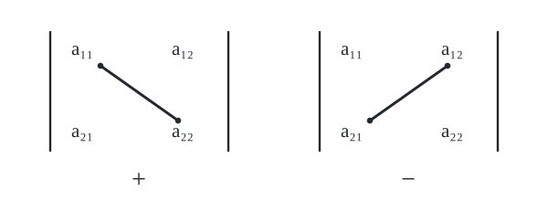
</p>

<p align="center"><em>Графическое правило вычисления определителя второго порядка</em></p>


**По графическому правилу:**


```math
\begin{vmatrix}a_{11}&a_{12}\\a_{21}&a_{22}\end{vmatrix}
=a_{11}a_{22}-a_{21}a_{12}.
```


**По определению:**


```math
\begin{aligned}
\begin{vmatrix}a_{11}&a_{12}\\a_{21}&a_{22}\end{vmatrix}
&=a_{11}A_{11}+a_{12}A_{12}\\
&=a_{11}(-1)^{1+1}M_{11}+a_{12}(-1)^{1+2}M_{12}\\
&=a_{11}a_{22}-a_{12}a_{21}.
\end{aligned}
```


### Графическое правило для $n=3$ (правило Саррюса)


<p align="center">
  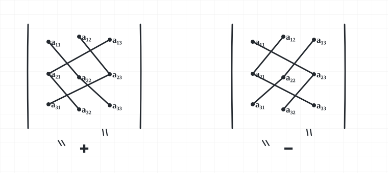
</p>

<p align="center"><em>Графическое правило Саррюса для определителя третьего порядка</em></p>


**По определению:**


```math
\begin{aligned}
\begin{vmatrix}
a_{11}&a_{12}&a_{13}\\
a_{21}&a_{22}&a_{23}\\
a_{31}&a_{32}&a_{33}
\end{vmatrix}
&=a_{11}(-1)^{1+1}M_{11}+a_{12}(-1)^{1+2}M_{12}+a_{13}(-1)^{1+3}M_{13}\\
&=a_{11}\begin{vmatrix}a_{22}&a_{23}\\a_{32}&a_{33}\end{vmatrix}
-a_{12}\begin{vmatrix}a_{21}&a_{23}\\a_{31}&a_{33}\end{vmatrix}
+a_{13}\begin{vmatrix}a_{21}&a_{22}\\a_{31}&a_{32}\end{vmatrix}\\
&=a_{11}(a_{22}a_{33}-a_{32}a_{23})
-a_{12}(a_{21}a_{33}-a_{31}a_{23})
+a_{13}(a_{21}a_{32}-a_{31}a_{22})\\
&=a_{11}a_{22}a_{33}-a_{11}a_{32}a_{23}-a_{12}a_{21}a_{33}
+a_{12}a_{31}a_{23}+a_{13}a_{21}a_{32}-a_{13}a_{31}a_{22}.
\end{aligned}
```


**По графическому правилу:**


```math
\begin{aligned}
\begin{vmatrix}
a_{11}&a_{12}&a_{13}\\
a_{21}&a_{22}&a_{23}\\
a_{31}&a_{32}&a_{33}
\end{vmatrix}
&=a_{11}a_{22}a_{33}+a_{21}a_{32}a_{13}+a_{12}a_{23}a_{31}\\
&\quad-a_{31}a_{22}a_{13}-a_{11}a_{23}a_{32}-a_{33}a_{21}a_{12}.
\end{aligned}
```


### Определитель нижней треугольной матрицы

Пусть $A_{n\times n}$ — нижняя треугольная матрица. Тогда


```math
|A|=a_{11}a_{22}\cdots a_{nn}.
```


**Д-во:** Индукцией по $n$.

**БИ:** $n=1$, $\det(a_{11})=a_{11}$.
**ШИ:** предположим, что формула верна для $n=k$. Покажем, что тогда она верна и для $n=k+1$:


```math
\begin{vmatrix}
a_{11}&0&0&\cdots&0\\
a_{21}&a_{22}&0&\cdots&0\\
a_{31}&a_{32}&a_{33}&\cdots&0\\
\vdots&\vdots&\vdots&\ddots&\vdots\\
a_{k+1,1}&a_{k+1,2}&a_{k+1,3}&\cdots&a_{k+1,k+1}
\end{vmatrix}
=a_{11}(-1)^{1+1}
\begin{vmatrix}
a_{22}&0&\cdots&0\\
a_{32}&a_{33}&\cdots&0\\
\vdots&\vdots&\ddots&\vdots\\
a_{k+1,2}&a_{k+1,3}&\cdots&a_{k+1,k+1}
\end{vmatrix}
=a_{11}a_{22}\cdots a_{nn}.\quad\blacksquare
```


[↑ К содержанию](#содержание)

---

<a id="ticket-6"></a>

## Билет 6. Понятие линейной зависимости применительно к матрицам-строкам. Лемма о линейной зависимости матриц-строк. Определитель с нулевой строкой, двумя равными строками и линейно зависимыми строками.

### Определения из полной тетради

**Определение 1.** Линейной комбинацией матриц-строк $S_1,S_2,\ldots,S_m$ одинаковой длины с коэффициентами соответственно $\alpha_1,\alpha_2,\ldots,\alpha_m$ называется матрица-строка


```math
\alpha_1S_1+\alpha_2S_2+\ldots+\alpha_mS_m.
```


**Определение 2.** Линейная комбинация называется **вырожденной**, если все её коэффициенты нулевые, **невырожденной** — в противном случае. Линейная комбинация называется **нулевой**, если она равна $0$; **ненулевой** — в противном случае.

**Замечание.** Вырожденная линейная комбинация всегда нулевая; невырожденная — не всегда.

**Определение 3.** Система матриц-строк $S_1,S_2,\ldots,S_m$ одинаковой длины называется **линейно зависимой**, если существует невырожденная, но нулевая линейная комбинация этих строк; эта система называется **линейно независимой** в противном случае.

### Лемма (о линейной зависимости)

1. Любая подсистема ЛНС тоже независима.
2. Система линейно зависима $\Longleftrightarrow$ одна из её матриц-строк может быть представлена в виде линейной комбинации других её матриц-строк.

**Д-во:**

**1)** Пусть подсистема у системы из $m$ строк содержит $l$ её строк $(l<m)$. Перенумеруем строки системы так, чтобы в подсистему входили первые $l$ строк:


```math
\underbrace{S_1,S_2,\ldots,S_l}_{\text{подсистема}},S_{l+1},\ldots,S_m.
```


Пусть вся система линейно независима, но (предположим) подсистема линейно зависима. Тогда существуют такие коэффициенты $\alpha_1,\alpha_2,\ldots,\alpha_l$, хотя бы один из которых ненулевой, что


```math
\alpha_1S_1+\alpha_2S_2+\ldots+\alpha_lS_l=0.
```


Следовательно,


```math
\alpha_1S_1+\ldots+\alpha_lS_l+0\cdot S_{l+1}+\ldots+0\cdot S_m=0,
```


причём хотя бы один из этих коэффициентов ненулевой. Значит, $S_1,S_2,\ldots,S_m$ линейно зависима. Противоречие.

**2) $\Rightarrow$** Пусть система $S_1,S_2,\ldots,S_m$ линейно зависима. Тогда существуют такие коэффициенты $\alpha_1,\alpha_2,\ldots,\alpha_m$, хотя бы один из которых не равен $0$, что


```math
\alpha_1S_1+\alpha_2S_2+\ldots+\alpha_iS_i+\ldots+\alpha_mS_m=0.
```


Пусть $\alpha_i\ne0$. Тогда


```math
S_i=-\frac{\alpha_1}{\alpha_i}S_1-\ldots-\frac{\alpha_{i-1}}{\alpha_i}S_{i-1}-\frac{\alpha_{i+1}}{\alpha_i}S_{i+1}-\ldots-\frac{\alpha_m}{\alpha_i}S_m.
```


**$\Leftarrow$** Пусть для некоторого номера $i\in\{1,2,\ldots,m\}$


```math
S_i=\beta_1S_1+\ldots+\beta_{i-1}S_{i-1}+\beta_{i+1}S_{i+1}+\ldots+\beta_mS_m.
```


Тогда


```math
-\beta_1S_1-\ldots-\beta_{i-1}S_{i-1}+1\cdot S_i-\beta_{i+1}S_{i+1}-\ldots-\beta_mS_m=0.
```


Так как коэффициент при $S_i$ равен $1\ne0$, система $S_1,S_2,\ldots,S_m$ линейно зависима. $\blacksquare$

### Теорема 1 (о св-вах определителя)

1. При перестановке 2-ух строк определитель умножается на $-1$.
2. Если в $i$-й строке стоит $S_i'+S_i''$, то определитель равен сумме двух определителей: с $S_i'$ и с $S_i''$ в этой строке.
3. Если в $i$-й строке стоит $\lambda S_i$, то $\lambda$ выносится за знак определителя.
4. $\forall A_{n\times n}\quad |A^t|=|A|$. Без доказательства.

### Следствие

**1)** Определитель с нулевой строкой равен $0$.


```math
\begin{vmatrix}S_1\\ \vdots\\ S_{i-1}\\ 0\\ S_{i+1}\\ \vdots\\ S_n\end{vmatrix}=\begin{vmatrix}S_1\\ \vdots\\ S_{i-1}\\ 0\cdot S_i\\ S_{i+1}\\ \vdots\\ S_n\end{vmatrix}=0\cdot\begin{vmatrix}S_1\\ \vdots\\ S_{i-1}\\ S_i\\ S_{i+1}\\ \vdots\\ S_n\end{vmatrix}=0.
```


**2)** Определитель, в котором есть две равные строки, равен $0$. При перестановке этих двух строк определитель, с одной стороны, не изменится, а с другой — изменит знак. Поэтому $|A|=-|A|$, откуда $|A|=0$.
**3)** Определитель с линейно зависимыми строками равен нулю.

Строки линейно зависимы $\Longleftrightarrow$ какая-то $i$-я строка может быть представлена в виде линейной комбинации остальных строк:


```math
S_i=\alpha_1S_1+\ldots+\alpha_{i-1}S_{i-1}+\alpha_{i+1}S_{i+1}+\ldots+\alpha_nS_n.
```


По свойствам 2) и 3) из теоремы 1 определитель раскладывается в сумму определителей, каждый из которых содержит две одинаковые строки, а значит каждый равен $0$. Следовательно исходный определитель равен $0$. $\blacksquare$


[↑ К содержанию](#содержание)

---

<a id="ticket-7"></a>

## Билет 7. Обратная матрица: единственность и условие существования. Формула для обращения матрицы.

### Определения из полной тетради

**Определение 1.** Матрица $B_{n\times n}$ называется **обратной** к матрице $A_{n\times n}$, если


```math
AB=BA=E_{n\times n}.
```


Обозначение: $B=A^{-1}$.

**Единичная матрица** $E_{n\times n}$ — квадратная матрица, у которой на главной диагонали стоят единицы, а остальные элементы равны нулю.

### Теорема 1 (о единственности $A^{-1}$)

Если существует $A^{-1}$, то она единственная.

**Д-во:** Пусть $(A^{-1})_1$ и $(A^{-1})_2$ — матрицы, обратные к $A$.


```math
\begin{aligned}
(A^{-1})_1A&=E\quad |\cdot(A^{-1})_2,\\
((A^{-1})_1A)(A^{-1})_2&=E(A^{-1})_2,\\
(A^{-1})_1(A(A^{-1})_2)&=(A^{-1})_2,\\
(A^{-1})_1E&=(A^{-1})_2,\\
(A^{-1})_1&=(A^{-1})_2.\quad\blacksquare
\end{aligned}
```


### Теорема 2 (условие существования $A^{-1}$, формула для $A^{-1}$)

Матрица $A$ обратима $\Longleftrightarrow$ $A$ не вырождена. В случае обратимости


```math
A^{-1}=\frac1{|A|}
\begin{pmatrix}
A_{11}&A_{21}&\cdots&A_{n1}\\
A_{12}&A_{22}&\cdots&A_{n2}\\
\vdots&\vdots&\ddots&\vdots\\
A_{1n}&A_{2n}&\cdots&A_{nn}
\end{pmatrix}.\tag{*}
```


**Д-во:**

**$\Rightarrow$** Пусть $A$ обратима. Тогда $AA^{-1}=E$, поэтому


```math
|AA^{-1}|=|E|\Rightarrow |A|\,|A^{-1}|=1\Rightarrow |A|\ne0.
```


**$\Leftarrow$** Пусть $A$ невырождена. Покажем, что матрица, определённая формулой $(*)$, действительно обратна к $A$.


```math
\frac1{|A|}
\begin{pmatrix}
A_{11}&A_{21}&\cdots&A_{n1}\\
A_{12}&A_{22}&\cdots&A_{n2}\\
\vdots&\vdots&\ddots&\vdots\\
A_{1n}&A_{2n}&\cdots&A_{nn}
\end{pmatrix}
\begin{pmatrix}
a_{11}&a_{12}&\cdots&a_{1n}\\
a_{21}&a_{22}&\cdots&a_{2n}\\
\vdots&\vdots&\ddots&\vdots\\
a_{n1}&a_{n2}&\cdots&a_{nn}
\end{pmatrix}.
```


На главной диагонали получаются суммы вида


```math
\frac1{|A|}\bigl(A_{1j}a_{1j}+A_{2j}a_{2j}+\ldots+A_{nj}a_{nj}\bigr)=\frac{|A|}{|A|}=1,
```


по теореме разложения определителя. Вне главной диагонали получаются суммы вида


```math
\frac1{|A|}\bigl(A_{1i}a_{1j}+A_{2i}a_{2j}+\ldots+A_{ni}a_{nj}\bigr)=0,\qquad i\ne j,
```


по теореме аннулирования для столбцов. Следовательно, произведение равно $E$.

При перемножении этих матриц в обратном порядке срабатывают эти же рассуждения: разложение определителя по строке и теорема аннулирования для строк; и тоже получается $E$. $\blacksquare$


[↑ К содержанию](#содержание)

---

<a id="ticket-8"></a>

## Билет 8. Теорема о правой обратной и левой обратной матрицах. Свойства операции обращения матриц.

### Определения из полной тетради

**Обратная матрица.** Матрица $B_{n\times n}$ называется обратной к матрице $A_{n\times n}$, если $AB=BA=E_{n\times n}$. Обозначение: $B=A^{-1}$.

**Определение 1.** Транспонированной матрицей $A_{m\times n}$ называется такая матрица $B_{n\times m}$, что $\forall j\in\{1,2,\ldots,n\}$ и $\forall i\in\{1,2,\ldots,m\}$: $b_{ji}=a_{ij}$. Обозначение: $B=A^t$.

**Единичная матрица** $E_{n\times n}$ — квадратная матрица, у которой на главной диагонали стоят единицы, а остальные элементы равны нулю.

### Теорема 1 (о правой обратной и левой обратной матрицах)


```math
\forall A_{n\times n},B_{n\times n}\qquad AB=E\Longleftrightarrow B=A^{-1}\Longleftrightarrow BA=E.
```


**Д-во:**

**$\Rightarrow$** $AB=E\Rightarrow |A|\,|B|=1\Rightarrow |A|\ne0\Rightarrow\exists A^{-1}$.


```math
\begin{aligned}
AB&=E\quad |\cdot A^{-1},\\
A^{-1}(AB)&=A^{-1}E,\\
(A^{-1}A)B&=A^{-1},\\
EB&=A^{-1},\\
B&=A^{-1}\Rightarrow BA=E.
\end{aligned}
```


**$\Leftarrow$** $BA=E\Rightarrow |B|\,|A|=1\Rightarrow |A|\ne0\Rightarrow\exists A^{-1}$.


```math
\begin{aligned}
BA&=E\quad |\cdot A^{-1},\\
(BA)A^{-1}&=EA^{-1},\\
B(AA^{-1})&=A^{-1},\\
BE&=A^{-1},\\
B&=A^{-1}\Rightarrow AB=E.\quad\blacksquare
\end{aligned}
```


### Теорема 2. Свойства $A^{-1}$

1. Если существует $A^{-1}$, то $(A^{-1})^{-1}=A$.
2. Если $\lambda\ne0$ и существует $A^{-1}$, то $(\lambda A)^{-1}=\lambda^{-1}A^{-1}$.
3. Если существует $A^{-1}$, то $(A^t)^{-1}=(A^{-1})^t$.
4. Если существуют $A^{-1}_{n\times n}$ и $B^{-1}_{n\times n}$, то $(AB)^{-1}=B^{-1}A^{-1}$.

**Д-во:**

**1)** $AA^{-1}=E\Rightarrow(A^{-1})^{-1}=A$.
**2)**


```math
(\lambda^{-1}A^{-1})(\lambda A)=(\lambda^{-1}\lambda)(A^{-1}A)=1\cdot E=E\Rightarrow(\lambda A)^{-1}=\lambda^{-1}A^{-1}.
```


**3)**


```math
(A^{-1})^tA^t=(AA^{-1})^t=E^t=E\Rightarrow(A^t)^{-1}=(A^{-1})^t.
```


**4)**


```math
(B^{-1}A^{-1})(AB)=\bigl(B^{-1}(A^{-1}A)\bigr)B=(B^{-1}E)B=B^{-1}B=E\Rightarrow(AB)^{-1}=B^{-1}A^{-1}.\quad\blacksquare
```


[↑ К содержанию](#содержание)

---

<a id="ticket-9"></a>

## Билет 9. Формулы Крамера. Критерий существования ненулевого решения у ОСЛУ с квадратной матрицей.

### Определения из полной тетради

**Система линейных уравнений (СЛУ)** имеет вид


```math
\begin{cases}
a_{11}x_1+a_{12}x_2+\ldots+a_{1n}x_n=b_1,\\
a_{21}x_1+a_{22}x_2+\ldots+a_{2n}x_n=b_2,\\
\qquad\vdots\\
a_{m1}x_1+a_{m2}x_2+\ldots+a_{mn}x_n=b_m,
\end{cases}
```


где $a_{ij}$ и $b_i$ — заданные (известные) числа, $x_j$ — неизвестные; $a_{ij}$ называются коэффициентами, $b_i$ — правыми частями или свободными слагаемыми.

Матрица $A=(a_{ij})$ называется **матрицей СЛУ**; $X=(x_1,\ldots,x_n)^t$ — **столбец неизвестных**; $B=(b_1,\ldots,b_m)^t$ — **столбец правых частей**.

Если $b_1=b_2=\ldots=b_m=0$, то СЛУ называется **однородной (ОСЛУ)**. Если существует $b_i\ne0$, то СЛУ называется **неоднородной (НСЛУ)**.

У ОСЛУ всегда есть решение вида $x_1=x_2=\ldots=x_n=0$; такое решение называется **нулевым** или **тривиальным**.

### Теорема 1 (формулы Крамера)

Рассмотрим СЛУ с квадратной матрицей:


```math
\begin{cases}
a_{11}x_1+a_{12}x_2+\ldots+a_{1n}x_n=b_1,\\
a_{21}x_1+a_{22}x_2+\ldots+a_{2n}x_n=b_2,\\
\qquad\vdots\\
a_{n1}x_1+a_{n2}x_2+\ldots+a_{nn}x_n=b_n.
\end{cases}\tag{1}
```


Пусть $\Delta=|A|\ne0$. Тогда у СЛУ (1) существует единственное решение, и это решение можно найти по следующим формулам:


```math
x_1=\frac{\Delta_1}{\Delta},\qquad x_2=\frac{\Delta_2}{\Delta},\qquad\ldots,\qquad x_n=\frac{\Delta_n}{\Delta},
```


где $\Delta_j$ — определитель, получающийся из $\Delta$ заменой $j$-го столбца на $B$.

**Д-во:** $|A|\ne0\Rightarrow\exists!A^{-1}$.


```math
A^{-1}\,|\,AX=B\qquad\Rightarrow\qquad A^{-1}AX=A^{-1}B\qquad\Rightarrow\qquad X=A^{-1}B.
```


```math
\begin{pmatrix}x_1\\x_2\\\vdots\\x_n\end{pmatrix}
=\frac1{|A|}
\begin{pmatrix}
A_{11}&A_{21}&\cdots&A_{n1}\\
A_{12}&A_{22}&\cdots&A_{n2}\\
\vdots&\vdots&\ddots&\vdots\\
A_{1n}&A_{2n}&\cdots&A_{nn}
\end{pmatrix}
\begin{pmatrix}b_1\\b_2\\\vdots\\b_n\end{pmatrix}
=\frac1\Delta
\begin{pmatrix}\Delta_1\\\Delta_2\\\vdots\\\Delta_n\end{pmatrix}.
```


> У ОСЛУ (причём и при $m\ne n$) всегда есть решение вида $x_1=x_2=\ldots=x_n=0$; такое решение называется **нулевым** или **тривиальным**.

### Теорема 2 (критерий существования нетривиального решения у ОСЛУ с квадратной матрицей)

У ОСЛУ с квадратной матрицей $A$ существует нетривиальное решение $\Longleftrightarrow |A|=0$.

**Д-во:**


```math
x_1\begin{pmatrix}a_{11}\\a_{21}\\\vdots\\a_{n1}\end{pmatrix}
+x_2\begin{pmatrix}a_{12}\\a_{22}\\\vdots\\a_{n2}\end{pmatrix}
+\ldots+
x_n\begin{pmatrix}a_{1n}\\a_{2n}\\\vdots\\a_{nn}\end{pmatrix}
=\begin{pmatrix}0\\0\\\vdots\\0\end{pmatrix}.
```


Существует нетривиальное решение $\Longleftrightarrow$ столбцы матрицы $A$ линейно зависимы $\Longleftrightarrow |A|=0$. $\blacksquare$


[↑ К содержанию](#содержание)

---

<a id="ticket-10"></a>

## Билет 10. Координаты вектора, получающегося при сложении векторов и умножении вектора на число. Вычисление координат векторов в ОНБ; вычисление скалярного произведения через координаты сомножителей в ОНБ.

### Определения из полной тетради

**Определение 1.** Базисом в пространстве называется любая упорядоченная тройка некомпланарных векторов.

**Определение 2.** В условиях т. 2 числа $\alpha_1,\alpha_2,\alpha_3$ называются **координатами** вектора $\vec a$ в базисе $Б$.

**Определение 3.** Базис называется **ортонормированным**, если его векторы попарно перпендикулярны и их длины равны $1$.

**Скалярное произведение** геометрических векторов:


```math
\vec a\cdot\vec b=
\begin{cases}
|\vec a|\,|\vec b|\cos(\vec a,\vec b),&\vec a\ne\vec0\text{ и }\vec b\ne\vec0,\\
0,&\vec a=\vec0\text{ или }\vec b=\vec0.
\end{cases}
```


### Теорема 1 (координаты вектора, получающегося при «+» и «·» на число)

Пусть $Б=(\vec e_1,\vec e_2,\vec e_3)$ — базис.

1. Если координатные строки $\vec a$ и $\vec b$ в $Б$ — $(\alpha_1,\alpha_2,\alpha_3)$ и $(\beta_1,\beta_2,\beta_3)$, то координатная строка $\vec a+\vec b$ в $Б$ — $(\alpha_1+\beta_1,\alpha_2+\beta_2,\alpha_3+\beta_3)$.
2. Если координатная строка $\vec a$ в $Б$ — $(\alpha_1,\alpha_2,\alpha_3)$, то для любого $\lambda\in\mathbb R$ координатная строка $\lambda\vec a$ в $Б$ — $(\lambda\alpha_1,\lambda\alpha_2,\lambda\alpha_3)$.

**Д-во:**

**1)**


```math
\begin{aligned}
\vec a&=\alpha_1\vec e_1+\alpha_2\vec e_2+\alpha_3\vec e_3,\\
\vec b&=\beta_1\vec e_1+\beta_2\vec e_2+\beta_3\vec e_3,\\
\vec a+\vec b&=(\alpha_1+\beta_1)\vec e_1+(\alpha_2+\beta_2)\vec e_2+(\alpha_3+\beta_3)\vec e_3.
\end{aligned}
```


**2)**


```math
\lambda\vec a=\lambda(\alpha_1\vec e_1+\alpha_2\vec e_2+\alpha_3\vec e_3)
=(\lambda\alpha_1)\vec e_1+(\lambda\alpha_2)\vec e_2+(\lambda\alpha_3)\vec e_3.\quad\blacksquare
```


> Теорема 1 распространяется на плоский и на прямолинейный случаи (только координат становится меньше).


<p align="center">
  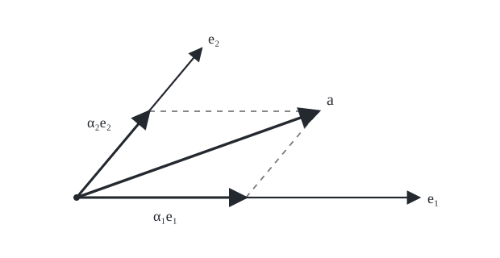
</p>

<p align="center"><em>Иллюстрация разложения вектора по базису</em></p>


Иллюстрация к основному свойству базиса в плоском случае

### Теорема 2 (координаты в ОНБ)

Пусть $(\vec e_1,\vec e_2,\vec e_3)$ — ОНБ.

1. Если координатная строка вектора $\vec a$ в $Б$ — $(\alpha_1,\alpha_2,\alpha_3)$, то $\forall i\in\{1,2,3\}$: $\alpha_i=\vec a\cdot\vec e_i$.
2. Если координатные строки $\vec a$ и $\vec b$ в $Б$ — $(\alpha_1,\alpha_2,\alpha_3)$ и $(\beta_1,\beta_2,\beta_3)$ соответственно, то $\vec a\cdot\vec b=\alpha_1\beta_1+\alpha_2\beta_2+\alpha_3\beta_3$.

**Д-во:**

**1)**


```math
\begin{aligned}
\vec a\cdot\vec e_1
&=(\alpha_1\vec e_1+\alpha_2\vec e_2+\alpha_3\vec e_3)\cdot\vec e_1\\
&=\alpha_1\vec e_1^{\,2}+\alpha_2(\vec e_2\cdot\vec e_1)+\alpha_3(\vec e_3\cdot\vec e_1)=\alpha_1,
\end{aligned}
```


так как $\vec e_1^{\,2}=1$, $\vec e_2\cdot\vec e_1=0$, $\vec e_3\cdot\vec e_1=0$. Аналогично доказывается для других $\alpha_i$.

**2)**


```math
\begin{aligned}
\vec a\cdot\vec b
&=(\alpha_1\vec e_1+\alpha_2\vec e_2+\alpha_3\vec e_3)
(\beta_1\vec e_1+\beta_2\vec e_2+\beta_3\vec e_3)\\
&=\alpha_1\beta_1+\alpha_2\beta_2+\alpha_3\beta_3.\quad\blacksquare
\end{aligned}
```


> **Замечание.** 1) $\vec a=\vec0\Rightarrow\vec a^{\,2}=0$.   2) $\vec a\perp\vec b\Longleftrightarrow\vec a\cdot\vec b=0$.

### Теорема 3. Свойства скалярного произведения

1. $\forall\vec a,\vec b\quad \vec a\cdot\vec b=\vec b\cdot\vec a$.
2. $\forall\vec a,\vec b,\vec c\quad (\vec a+\vec b)\cdot\vec c=\vec a\cdot\vec c+\vec b\cdot\vec c$.
3. $\forall\vec a,\vec b\ \forall\lambda\in\mathbb R\quad (\lambda\vec a)\cdot\vec b=\lambda(\vec a\cdot\vec b)$.
4. $\forall\vec a\quad \vec a^{\,2}=\vec a\cdot\vec a=0\Rightarrow\vec a=\vec0$. Без доказательства.

> **Замечание.** Из свойств 1–4 вытекает, что множество геометрических векторов — частный случай евклидова пространства.


[↑ К содержанию](#содержание)

---

<a id="ticket-11"></a>

## Билет 11. Свойства векторного произведения: критерий коллинеарности векторов; геометрический смысл векторного произведения; формула для вычисления векторного произведения через координаты сомножителей в правом ОНБ.

### Определения из полной тетради

**Определение 1.** Векторным произведением векторов $\vec a$ и $\vec b$ называется $[\vec a\times\vec b]$, определённый следующим образом:

1. если $\vec a\parallel\vec b$, то $[\vec a\times\vec b]=\vec0$;
2. если $\vec a\nparallel\vec b$, то:
   1. $[\vec a\times\vec b]\perp\vec a,\vec b$;
   2. $(\vec a,\vec b,[\vec a\times\vec b])$ — правая тройка;
   3. $|[\vec a\times\vec b]|=|\vec a|\,|\vec b|\sin(\widehat{\vec a,\vec b})$.

**Определение 2.** Базис называется **ортонормированным**, если его векторы попарно перпендикулярны и их длины равны $1$.

**Определение 3.** Пусть векторы $\vec a,\vec b,\vec c$ некомпланарны и отложены от одной точки. Упорядоченная тройка векторов $(\vec a,\vec b,\vec c)$ называется правой (левой), если поворот от вектора $\vec a$ к вектору $\vec b$ по наименьшему углу с конца вектора $\vec c$ видится происходящим против часовой стрелки (по часовой стрелке).

### Теорема 1 (св-ва «×»)

1. $\forall\vec a,\vec b\quad [\vec a\times\vec b]=-[\vec b\times\vec a]$.
2. $\forall\vec a,\vec b,\vec c\quad [ (\vec a+\vec b)\times\vec c]=[\vec a\times\vec c]+[\vec b\times\vec c]$.
3. $\forall\vec a,\vec b\ \forall\lambda\in\mathbb R\quad [\lambda\vec a\times\vec b]=\lambda[\vec a\times\vec b]$.

### Следствие 1. Критерий коллинеарности


```math
\vec a\parallel\vec b\Longleftrightarrow[\vec a\times\vec b]=\vec0.
```


**Д-во:**

**$\Rightarrow$** Непосредственно следует из определения векторного произведения.
**$\Leftarrow$** Пусть $[\vec a\times\vec b]=\vec0$. Предположим, что $\vec a\nparallel\vec b$. Тогда


```math
|\vec a|\,|\vec b|\sin(\widehat{\vec a,\vec b})=0.
```


Если $|\vec a|=0$, то $\vec a=\vec0\Rightarrow\vec a\parallel\vec b$. Если $|\vec b|=0$, то $\vec b=\vec0\Rightarrow\vec a\parallel\vec b$. Если $\sin(\widehat{\vec a,\vec b})=0$, то $\widehat{\vec a,\vec b}=0$ или $\widehat{\vec a,\vec b}=\pi\Rightarrow\vec a\parallel\vec b$. Противоречие. Следовательно, $\vec a\parallel\vec b$. $\blacksquare$

### Следствие 2. Геометрический смысл


<p align="center">
  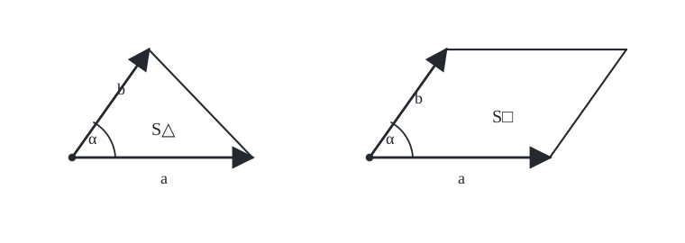
</p>

<p align="center"><em>Геометрический смысл векторного произведения</em></p>


*Площади треугольника и параллелограмма на векторах $\vec a$ и $\vec b$*


```math
S_{\triangle}=\frac12\,|[\vec a\times\vec b]|,\qquad S_{\Box}=|[\vec a\times\vec b]|.
```


**Д-во:**


```math
S_{\triangle}=\frac12|\vec a|\,|\vec b|\sin\alpha=\frac12|[\vec a\times\vec b]|,
```


```math
S_{\Box}=|\vec a|\,|\vec b|\sin\alpha=|[\vec a\times\vec b]|.
```


### Следствие 3. Вычисление через координаты в правом ОНБ

Пусть в правом ОНБ $(\vec i,\vec j,\vec k)$ векторы $\vec a$ и $\vec b$ имеют координаты $(a_x,a_y,a_z)$ и $(b_x,b_y,b_z)$. Тогда


```math
[\vec a\times\vec b]=
\begin{vmatrix}
\vec i&\vec j&\vec k\\
a_x&a_y&a_z\\
b_x&b_y&b_z
\end{vmatrix}.
```


**Д-во:** $[\vec i\times\vec j]\perp\vec i,\vec j\Rightarrow[\vec i\times\vec j]\parallel\vec k$, $(\vec i,\vec j,[\vec i\times\vec j])$ — правая тройка, $|[\vec i\times\vec j]|=1\cdot1\cdot\sin\frac\pi2=1\Rightarrow[\vec i\times\vec j]=\vec k$. Аналогично $[\vec j\times\vec k]=\vec i$ и $[\vec k\times\vec i]=\vec j$.


```math
\begin{aligned}
[\vec a\times\vec b]
&=[(a_x\vec i+a_y\vec j+a_z\vec k)\times(b_x\vec i+b_y\vec j+b_z\vec k)]\\
&=(a_xb_y-a_yb_x)\vec k-(a_xb_z-a_zb_x)\vec j+(a_yb_z-a_zb_y)\vec i\\
&=\begin{vmatrix}\vec i&\vec j&\vec k\\a_x&a_y&a_z\\b_x&b_y&b_z\end{vmatrix}.\quad\blacksquare
\end{aligned}
```


[↑ К содержанию](#содержание)

---

<a id="ticket-12"></a>

## Билет 12. Свойства векторного произведения: формула «БАЦ минус ЦАБ», тождество Якоби.

### Определения из полной тетради

**Определение 1.** Векторным произведением векторов $\vec a$ и $\vec b$ называется $[\vec a\times\vec b]$, определённый следующим образом:

1. если $\vec a\parallel\vec b$, то $[\vec a\times\vec b]=\vec0$;
2. если $\vec a\nparallel\vec b$, то:
   1. $[\vec a\times\vec b]\perp\vec a,\vec b$;
   2. $(\vec a,\vec b,[\vec a\times\vec b])$ — правая тройка;
   3. $|[\vec a\times\vec b]|=|\vec a|\,|\vec b|\sin(\widehat{\vec a,\vec b})$.

**Определение 2.** Пусть векторы $\vec a,\vec b,\vec c$ некомпланарны и отложены от одной точки. Упорядоченная тройка векторов $(\vec a,\vec b,\vec c)$ называется правой (левой), если поворот от вектора $\vec a$ к вектору $\vec b$ по наименьшему углу с конца вектора $\vec c$ видится происходящим против часовой стрелки (по часовой стрелке).

**Скалярное произведение** геометрических векторов:


```math
\vec a\cdot\vec b=
\begin{cases}
|\vec a|\,|\vec b|\cos(\widehat{\vec a,\vec b}),&\vec a\ne\vec0\text{ и }\vec b\ne\vec0,\\
0,&\vec a=\vec0\text{ или }\vec b=\vec0.
\end{cases}
```


### 4) Формула «БАЦ минус ЦАБ»


```math
[\vec a\times[\vec b\times\vec c]]=\vec b(\vec a\cdot\vec c)-\vec c(\vec a\cdot\vec b).
```


**Д-во:**


```math
[\vec b\times\vec c]=
\begin{vmatrix}\vec i&\vec j&\vec k\\b_x&b_y&b_z\\c_x&c_y&c_z\end{vmatrix}
=(b_yc_z-b_zc_y)\vec i+(b_zc_x-b_xc_z)\vec j+(b_xc_y-b_yc_x)\vec k.
```


```math
\begin{aligned}
[\vec a\times[\vec b\times\vec c]]
&=\bigl(a_y(b_xc_y-b_yc_x)-a_z(b_zc_x-b_xc_z)\bigr)\vec i\\
&\quad+\bigl(a_z(b_yc_z-b_zc_y)-a_x(b_xc_y-b_yc_x)\bigr)\vec j\\
&\quad+\bigl(a_x(b_zc_x-b_xc_z)-a_y(b_yc_z-b_zc_y)\bigr)\vec k\\
&=\bigl(a_yb_xc_y-a_yb_yc_x-a_zb_zc_x+a_zb_xc_z\bigr)\vec i\\
&\quad+\bigl(a_zb_yc_z-a_zb_zc_y-a_xb_xc_y+a_xb_yc_x\bigr)\vec j\\
&\quad+\bigl(a_xb_zc_x-a_xb_xc_z-a_yb_yc_z+a_yb_zc_y\bigr)\vec k.
\end{aligned}
```


```math
\begin{aligned}
\vec b(\vec a\cdot\vec c)-\vec c(\vec a\cdot\vec b)
&=\bigl(b_x(a_xc_x+a_yc_y+a_zc_z)-c_x(a_xb_x+a_yb_y+a_zb_z)\bigr)\vec i\\
&\quad+\bigl(b_y(a_xc_x+a_yc_y+a_zc_z)-c_y(a_xb_x+a_yb_y+a_zb_z)\bigr)\vec j\\
&\quad+\bigl(b_z(a_xc_x+a_yc_y+a_zc_z)-c_z(a_xb_x+a_yb_y+a_zb_z)\bigr)\vec k.
\end{aligned}
```


После раскрытия скобок одинаковые слагаемые сокращаются; слагаемые в скобках совпадают. $\blacksquare$

### 5) Тождество Якоби


```math
[\vec a\times[\vec b\times\vec c]]+[\vec b\times[\vec c\times\vec a]]+[\vec c\times[\vec a\times\vec b]]=\vec0.
```


**Д-во:**


```math
\begin{aligned}
&[\vec a\times[\vec b\times\vec c]]+[\vec b\times[\vec c\times\vec a]]+[\vec c\times[\vec a\times\vec b]]\\
&=[\text{по «БАЦ минус ЦАБ»}]\\
&=\vec b(\vec a\cdot\vec c)-\vec c(\vec a\cdot\vec b)
+\vec c(\vec b\cdot\vec a)-\vec a(\vec b\cdot\vec c)
+\vec a(\vec c\cdot\vec b)-\vec b(\vec c\cdot\vec a)=\vec0.\quad\blacksquare
\end{aligned}
```


[↑ К содержанию](#содержание)

---

<a id="ticket-13"></a>

## Билет 13. Свойства смешанного умножения: критерий компланарности; критерий правой и левой тройки; геометрический смысл смешанного произведения.

### Определения из полной тетради

**Определение 1.** Смешанным произведением векторов $\vec a,\vec b$ и $\vec c$ называется число


```math
\vec a\vec b\vec c=[\vec a\times\vec b]\cdot\vec c.
```


**Определение 2.** Пусть векторы $\vec a,\vec b,\vec c$ некомпланарны и отложены от одной точки. Упорядоченная тройка векторов $(\vec a,\vec b,\vec c)$ называется правой (левой), если поворот от вектора $\vec a$ к вектору $\vec b$ по наименьшему углу с конца вектора $\vec c$ видится происходящим против часовой стрелки (по часовой стрелке).

Векторы $\vec a,\vec b,\vec c$ называются **компланарными**, если, будучи отложенными от одной точки, они лежат в одной плоскости; некомпланарными — в противном случае.

### 1) Критерий компланарности


```math
\vec a,\vec b,\vec c\text{ компланарны}\Longleftrightarrow\vec a\vec b\vec c=0.
```


**Д-во:**

**$\Rightarrow$** Пусть $\vec a,\vec b,\vec c$ компланарны.

**I)** Если $\vec a\parallel\vec b$, то $[\vec a\times\vec b]=\vec0$, поэтому $[\vec a\times\vec b]\cdot\vec c=\vec0\cdot\vec c=0$.

**II)** Если $\vec a\nparallel\vec b$, то $[\vec a\times\vec b]\perp\vec c$, следовательно $[\vec a\times\vec b]\cdot\vec c=0$.

**$\Leftarrow$** Пусть $\vec a\vec b\vec c=0$.

**I)** Если $\vec a\parallel\vec b$, то $\vec a,\vec b,\vec c$ компланарны в силу коллинеарности $\vec a$ и $\vec b$.

**II)** Если $\vec a\nparallel\vec b$, но $\vec a\vec b\vec c=0$, то $[\vec a\times\vec b]\cdot\vec c=0$. Отсюда либо $\vec c=\vec0$ (и $\vec a,\vec b,\vec c$ компланарны), либо $\vec c\ne\vec0$, но $[\vec a\times\vec b]\perp\vec c$. Тогда $\vec c$ лежит в плоскости векторов $\vec a$ и $\vec b$ (если $\vec a,\vec b,\vec c$ отложены от одной точки), следовательно $\vec a,\vec b,\vec c$ компланарны. $\blacksquare$

### 2) Критерий правой и левой тройки


```math
(\vec a,\vec b,\vec c)\text{ — правая тройка}\Longleftrightarrow\vec a\vec b\vec c>0,
```


```math
(\vec a,\vec b,\vec c)\text{ — левая тройка}\Longleftrightarrow\vec a\vec b\vec c<0.
```


**Д-во:** Во всех случаях $\vec a\nparallel\vec b$.


<p align="center">
  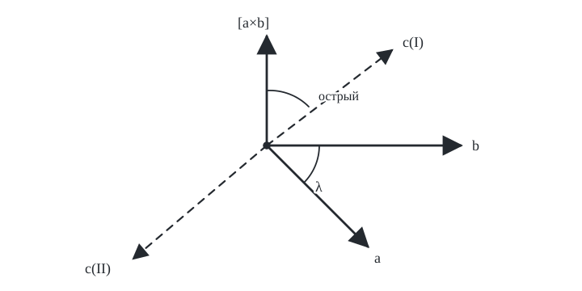
</p>

<p align="center"><em>Правая и левая тройки векторов</em></p>


**I)** $(\vec a,\vec b,\vec c)$ — правая $\Longleftrightarrow([\vec a\times\vec b],\vec c)$ — острый $\Longleftrightarrow[\vec a\times\vec b]\cdot\vec c>0\Longleftrightarrow\vec a\vec b\vec c>0$.

**II)** $(\vec a,\vec b,\vec c)$ — левая $\Longleftrightarrow([\vec a\times\vec b],\vec c)$ — тупой $\Longleftrightarrow[\vec a\times\vec b]\cdot\vec c<0\Longleftrightarrow\vec a\vec b\vec c<0$.

### 3) Геометрический смысл $\vec a\vec b\vec c$


<p align="center">
  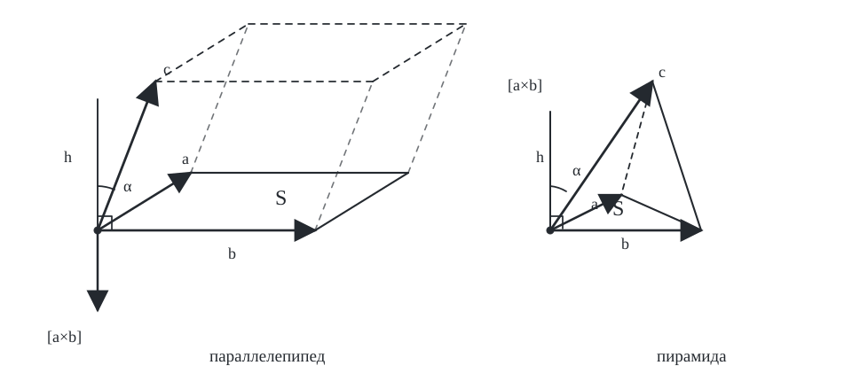
</p>

<p align="center"><em>Геометрический смысл смешанного произведения</em></p>


*Параллелепипед и пирамида, построенные на $\vec a,\vec b,\vec c$*


```math
V_{\text{пар}}=S\cdot h=|[\vec a\times\vec b]|\,|\vec c|\,|\cos([\vec a\times\vec b],\vec c)|=|\vec a\vec b\vec c|.
```


```math
V_{\text{пир}}=\frac13Sh=\frac13\cdot\frac12|[\vec a\times\vec b]|\,|\vec c|\,|\cos\alpha|=\frac16|\vec a\vec b\vec c|.
```


[↑ К содержанию](#содержание)

---

<a id="ticket-14"></a>

## Билет 14. Свойства смешанного умножения: формула для вычисления смешанного произведения через координаты сомножителей в правом ОНБ; различные перестановки сомножителей в смешанном произведении.

### Определения из полной тетради

**Определение 1.** Смешанным произведением векторов $\vec a,\vec b$ и $\vec c$ называется число $\vec a\vec b\vec c=[\vec a\times\vec b]\cdot\vec c$.

**Определение 2.** Базис называется **ортонормированным**, если его векторы попарно перпендикулярны и их длины равны $1$.

**Определение 3.** Упорядоченная тройка некомпланарных векторов $(\vec a,\vec b,\vec c)$, отложенных от одной точки, называется правой (левой), если поворот от $\vec a$ к $\vec b$ по наименьшему углу с конца $\vec c$ видится против часовой стрелки (по часовой стрелке).

### 4) Вычисление $\vec a\vec b\vec c$ через координаты сомножителей в правом ОНБ

Пусть $\vec a(a_x,a_y,a_z)$, $\vec b(b_x,b_y,b_z)$, $\vec c(c_x,c_y,c_z)$ — координаты в некотором правом ОНБ. Тогда


```math
\vec a\vec b\vec c=
\begin{vmatrix}
a_x&a_y&a_z\\
b_x&b_y&b_z\\
c_x&c_y&c_z
\end{vmatrix}.
```


**Д-во:**


```math
[\vec a\times\vec b]=
\begin{vmatrix}\vec i&\vec j&\vec k\\a_x&a_y&a_z\\b_x&b_y&b_z\end{vmatrix}
=\begin{vmatrix}a_y&a_z\\b_y&b_z\end{vmatrix}\vec i-
\begin{vmatrix}a_x&a_z\\b_x&b_z\end{vmatrix}\vec j+
\begin{vmatrix}a_x&a_y\\b_x&b_y\end{vmatrix}\vec k.
```


```math
\begin{aligned}
\vec a\vec b\vec c&=[\vec a\times\vec b]\cdot\vec c\\
&=\begin{vmatrix}a_y&a_z\\b_y&b_z\end{vmatrix}c_x-
\begin{vmatrix}a_x&a_z\\b_x&b_z\end{vmatrix}c_y+
\begin{vmatrix}a_x&a_y\\b_x&b_y\end{vmatrix}c_z\\
&=\begin{vmatrix}a_x&a_y&a_z\\b_x&b_y&b_z\\c_x&c_y&c_z\end{vmatrix}.\quad\blacksquare
\end{aligned}
```


### 5) Перестановки сомножителей в $\vec a\vec b\vec c$


```math
\vec a\vec b\vec c=\vec b\vec c\vec a=\vec c\vec a\vec b
=-\vec b\vec a\vec c=-\vec c\vec b\vec a=-\vec a\vec c\vec b.
```


**Д-во:**


```math
\begin{aligned}
\vec a\vec b\vec c
&=\begin{vmatrix}a_x&a_y&a_z\\b_x&b_y&b_z\\c_x&c_y&c_z\end{vmatrix}
=-\begin{vmatrix}b_x&b_y&b_z\\a_x&a_y&a_z\\c_x&c_y&c_z\end{vmatrix}\\
&=\begin{vmatrix}b_x&b_y&b_z\\c_x&c_y&c_z\\a_x&a_y&a_z\end{vmatrix}
=-\begin{vmatrix}a_x&a_y&a_z\\c_x&c_y&c_z\\b_x&b_y&b_z\end{vmatrix}\\
&=\begin{vmatrix}c_x&c_y&c_z\\a_x&a_y&a_z\\b_x&b_y&b_z\end{vmatrix}
=-\begin{vmatrix}c_x&c_y&c_z\\b_x&b_y&b_z\\a_x&a_y&a_z\end{vmatrix}.\quad\blacksquare
\end{aligned}
```


[↑ К содержанию](#содержание)

---

<a id="ticket-15"></a>

## Билет 15. Теорема об общем уравнении прямой на плоскости.

### Определения из полной тетради

**Определение 1.** Вектор $\vec n\ne\vec0$, перпендикулярный прямой $L$, называется **нормальным вектором** этой прямой.

### Теорема 1 (об общем уравнении прямой на плоскости)

1. Любая прямая на плоскости может быть задана уравнением вида
   

```math
Ax+By+C=0,\qquad A^2+B^2>0.\tag{1}
```


2. Любое уравнение вида (1) определяет прямую на плоскости.

**Д-во:**

**1)** Пусть $L$ — некоторая прямая на плоскости; $M_0$ — точка, $M_0\in L$, $M_0(x_0;y_0)$. Пусть $\vec n\ne\vec0$, $\vec n\perp L$, $\vec n=(A,B)$, $A^2+B^2>0$.


<p align="center">
  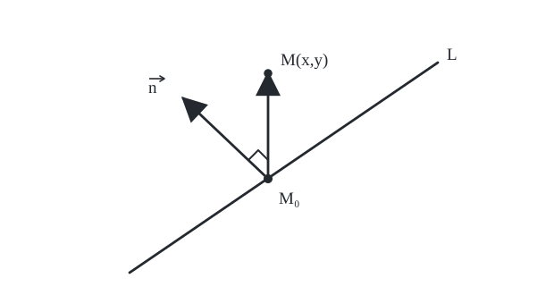
</p>

<p align="center"><em>Схема прямой, точки M₀, точки M и нормального вектора n</em></p>


```math
M\in L\Longleftrightarrow\overrightarrow{M_0M}\perp\vec n
\Longleftrightarrow\vec n\cdot\overrightarrow{M_0M}=0
\Longleftrightarrow A(x-x_0)+B(y-y_0)=0.
```


```math
Ax+By-Ax_0-By_0=0.
```


Обозначим $-Ax_0-By_0=C$. Получаем уравнение вида (1).

**2)** Пусть некоторый геометрический объект $L'$ задан уравнением вида (1):


```math
L':\ Ax+By+C=0,\qquad A^2+B^2>0.
```


Рассмотрим случай $B\ne0$ ($A\ne0$ аналогично). Определим $\vec n=(A,B)$, $M_0\left(0,-\frac CB\right)$. Существует единственная прямая $L$, проходящая через точку $M_0$ и перпендикулярная $\vec n$. По схеме, показанной в доказательстве части 1), составим общее уравнение прямой $L$:


```math
L:\ A(x-0)+B\left(y+\frac CB\right)=0\Longleftrightarrow Ax+By+C=0.
```


Уравнения $L'$ и $L$ совпадают $\Longleftrightarrow M(x,y)\in L'\Longleftrightarrow M(x,y)\in L\Longleftrightarrow L'$ и $L$ как множества точек на плоскости совпадают $\Longleftrightarrow L'=L$, то есть $L'$ — прямая. $\blacksquare$


[↑ К содержанию](#содержание)

---

<a id="ticket-16"></a>

## Билет 16. Формула для расстояния от точки до прямой на плоскости; формула для расстояния между параллельными прямыми на плоскости.

### Определения из полной тетради

**Определение 1.** Вектор $\vec n\ne\vec0$, перпендикулярный прямой $L$, называется **нормальным вектором** этой прямой.

### Следствие 1. Формула для расстояния от точки до прямой на плоскости

Пусть


```math
L:\ Ax+By+C=0,\qquad A^2+B^2>0,\qquad M_1(x_1,y_1).
```


Тогда


```math
\rho(M_1,L)=\frac{|Ax_1+By_1+C|}{\sqrt{A^2+B^2}}.
```


**Д-во:**


<p align="center">
  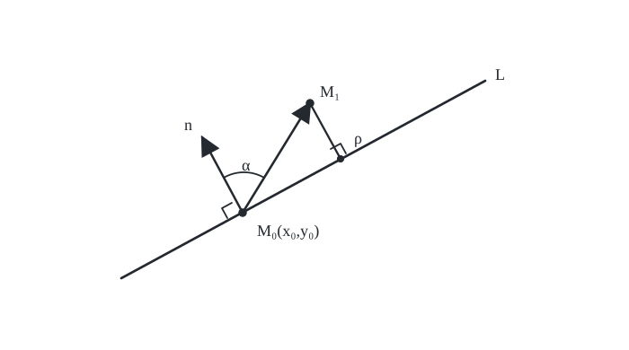
</p>

<p align="center"><em>Расстояние от точки M₁ до прямой L — схема по тетради</em></p>


```math
\begin{aligned}
\rho(M_1,L)
&=|\overrightarrow{M_0M_1}|\cos\alpha
=|\overrightarrow{M_0M_1}|\,|\cos(\overrightarrow{M_0M_1},\vec n)|\\
&=\frac{|\overrightarrow{M_0M_1}|\,|\vec n|\,|\cos(\overrightarrow{M_0M_1},\vec n)|}{|\vec n|}
=\frac{|\overrightarrow{M_0M_1}\cdot\vec n|}{|\vec n|}\\
&=\frac{|(x_1-x_0)A+(y_1-y_0)B|}{\sqrt{A^2+B^2}}\\
&=\frac{|Ax_1+By_1-Ax_0-By_0|}{\sqrt{A^2+B^2}}.
\end{aligned}
```


Так как $Ax_0+By_0+C=0\Longleftrightarrow-Ax_0-By_0=C$, то


```math
\rho(M_1,L)=\frac{|Ax_1+By_1+C|}{\sqrt{A^2+B^2}}.\quad\blacksquare
```


### Следствие 2. Формула для расстояния между параллельными прямыми на плоскости

Если $L_1\parallel L_2$, то уравнения этих прямых могут быть приведены к виду


```math
L_1:\ Ax+By+C_1=0,\qquad L_2:\ Ax+By+C_2=0,\qquad A^2+B^2>0.
```


Тогда


```math
\rho(L_1,L_2)=\frac{|C_2-C_1|}{\sqrt{A^2+B^2}}.
```


**Д-во:**


<p align="center">
  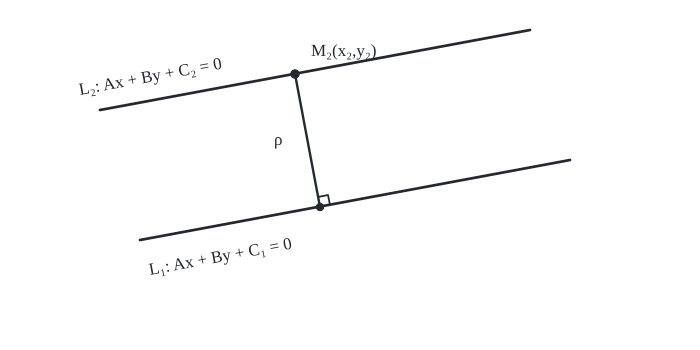
</p>

<p align="center"><em>Расстояние между параллельными прямыми — схема по тетради</em></p>


Так как $\vec n_1\parallel\vec n_2$, то $\vec n_1=\alpha\vec n_2$, $\alpha\ne0$. После деления уравнения одной прямой на $\alpha$ коэффициенты при $x$ и $y$ можно сделать одинаковыми.

Возьмём $M_2(x_2,y_2)\in L_2$. Тогда


```math
\begin{aligned}
\rho(L_1,L_2)&=\rho(M_2,L_1)=\frac{|Ax_2+By_2+C_1|}{\sqrt{A^2+B^2}}\\
&=[Ax_2+By_2+C_2=0\Longleftrightarrow Ax_2+By_2=-C_2]\\
&=\frac{|C_1-C_2|}{\sqrt{A^2-B^2}}=\frac{|C_2-C_1|}{\sqrt{A^2-B^2}}.\quad\blacksquare
\end{aligned}
```


[↑ К содержанию](#содержание)

---

<a id="ticket-17"></a>

## Билет 17. Каноническое уравнение эллипса.

### Определения из полной тетради

**Определение 1.** Эллипсом называется геометрическое место точек, сумма расстояний от каждой из которых до двух данных, называемых фокусами, есть величина постоянная, большая, чем расстояние между фокусами.

**Определение 2.** Уравнение вида $\dfrac{x^2}{a^2}+\dfrac{y^2}{b^2}=1$ называется **каноническим уравнением эллипса**; система координат $xOy$, в условиях теоремы 1, называется канонической системой координат для данного эллипса.

### Теорема 1 (о каноническом уравнении эллипса)

При некотором выборе системы координат $xOy$ уравнение эллипса принимает следующий вид:


```math
\frac{x^2}{a^2}+\frac{y^2}{b^2}=1,\qquad a>b>0.
```


**Док-во:**


<p align="center">
  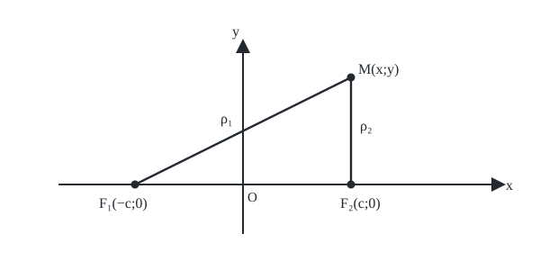
</p>

<p align="center"><em>Эллипс и его фокусы</em></p>


*ρ₁ + ρ₂ = 2a = const, 2a > 2c ⇔ a > c.*


```math
\sqrt{(x+c)^2+y^2}+\sqrt{(x-c)^2+y^2}=2a.
```


```math
\begin{aligned}
\sqrt{(x+c)^2+y^2}&=2a-\sqrt{(x-c)^2+y^2}\quad |^2,\\
(x+c)^2+y^2&=4a^2-4a\sqrt{(x-c)^2+y^2}+(x-c)^2+y^2,\\
2cx&=2a^2-2a\sqrt{(x-c)^2+y^2},\\
a\sqrt{(x-c)^2+y^2}&=a^2-cx\quad |^2,\\
a^2\bigl((x-c)^2+y^2\bigr)&=a^4-2a^2cx+c^2x^2,\\
a^2(x^2-2cx+c^2+y^2)&=a^4-2a^2cx+c^2x^2,\\
(a^2-c^2)x^2+a^2y^2&=a^2(a^2-c^2),\\
\frac{x^2}{a^2}+\frac{y^2}{a^2-c^2}&=1.
\end{aligned}
```


Положим $b^2=a^2-c^2$, $b>0$. Тогда


```math
\frac{x^2}{a^2}+\frac{y^2}{b^2}=1.
```


Покажем, что при двукратном возведении в квадрат не появилось посторонних решений $(x;y)$.


```math
y^2=(a^2-c^2)\left(1-\frac{x^2}{a^2}\right).
```


```math
\sqrt{(x+c)^2+y^2}=\left|a+\frac{cx}{a}\right|,\qquad
\sqrt{(x-c)^2+y^2}=\left|a-\frac{cx}{a}\right|.
```


Так как $\dfrac ca<1$, из $\dfrac{x^2}{a^2}\le1$ следует $|x|\le a$.

**I) $x>0$**


```math
\left|a+\frac{cx}{a}\right|+\left|a-\frac{cx}{a}\right|=a+\frac{cx}{a}+a-\frac{cx}{a}=2a.
```


**II) $x<0$**


```math
\left|a-\frac{c|x|}{a}\right|+\left|a+\frac{c|x|}{a}\right|=a-\frac{c|x|}{a}+a+\frac{c|x|}{a}=2a.\quad\blacksquare
```


> **Чертёж.** $O(0;0)$ — центр эллипса; прямые $y=0$ и $x=0$ — оси эллипса; $a$ — большая полуось, $b$ — малая полуось. Точки $A_1(-a;0),A_2(a;0),B_1(0;-b),B_2(0;b)$ — вершины эллипса.


<p align="center">
  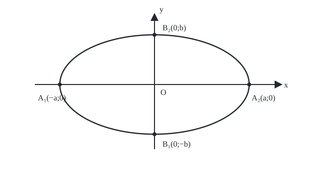
</p>

<p align="center"><em>Канонический чертёж эллипса</em></p>


[↑ К содержанию](#содержание)

---

<a id="ticket-18"></a>

## Билет 18. Каноническое уравнение гиперболы.

### Определения из полной тетради

**Определение 1.** Гиперболой называется геометрическое место точек в плоскости, модуль разности расстояний от каждой из которых до двух данных, называемых фокусами, есть величина постоянная, меньшая, чем расстояние между фокусами.

**Определение 2.** Уравнение вида $\dfrac{x^2}{a^2}-\dfrac{y^2}{b^2}=1$ называется **каноническим уравнением гиперболы**; система координат $xOy$, в условиях теоремы 1, называется канонической системой координат для данной гиперболы.

### Теорема 1 (о каноническом уравнении гиперболы)

При некотором выборе системы координат $xOy$ уравнение гиперболы принимает следующий вид:


```math
\frac{x^2}{a^2}-\frac{y^2}{b^2}=1,\qquad a>0,\ b>0.
```


**Док-во:**


<p align="center">
  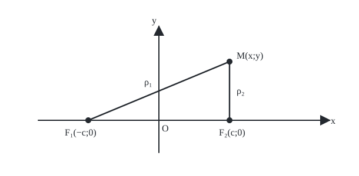
</p>

<p align="center"><em>Гипербола и её фокусы</em></p>


*|ρ₂ − ρ₁| = 2a = const, 2a < 2c ⇔ a < c.*


```math
\sqrt{(x-c)^2+y^2}-\sqrt{(x+c)^2+y^2}=\pm2a.
```


```math
\begin{aligned}
\sqrt{(x-c)^2+y^2}&=\sqrt{(x+c)^2+y^2}\pm2a\quad |^2,\\
(x-c)^2+y^2&=(x+c)^2+y^2\pm4a\sqrt{(x+c)^2+y^2}+4a^2,\\
\mp4a\sqrt{(x+c)^2+y^2}&=-4cx-4a^2\quad |:4,\\
\pm a\sqrt{(x+c)^2+y^2}&=cx+a^2\quad |^2,\\
a^2\bigl((x+c)^2+y^2\bigr)&=c^2x^2+2a^2cx+a^4,\\
a^2(x^2+2cx+c^2+y^2)&=c^2x^2+2a^2cx+a^4,\\
(c^2-a^2)x^2-a^2y^2&=a^2(c^2-a^2),\\
\frac{x^2}{a^2}-\frac{y^2}{c^2-a^2}&=1.
\end{aligned}
```


Положим $b^2=c^2-a^2$, $b>0$. Тогда


```math
\frac{x^2}{a^2}-\frac{y^2}{b^2}=1.
```


Покажем, что двукратное возведение в квадрат не привело к посторонним решениям.


```math
y^2=(c^2-a^2)\left(\frac{x^2}{a^2}-1\right).
```


```math
\sqrt{(x+c)^2+y^2}=\left|a+\frac{cx}{a}\right|,\qquad
\sqrt{(x-c)^2+y^2}=\left|a-\frac{cx}{a}\right|.
```


Так как $\dfrac ca>1$ и $\dfrac{x^2}{a^2}=1+\dfrac{y^2}{b^2}\ge1$, то $|x|\ge a$.

**I) $x>0$**


```math
\left|a+\frac{cx}{a}\right|-\left|a-\frac{cx}{a}\right|=a+\frac{cx}{a}-\left(\frac{cx}{a}-a\right)=2a.
```


**II) $x<0$**


```math
\left|a-\frac{c|x|}{a}\right|-\left|a+\frac{c|x|}{a}\right|=\frac{c|x|}{a}-a-\left(a+\frac{c|x|}{a}\right)=-2a.\quad\blacksquare
```


> **Чертёж.** $O(0;0)$ — центр гиперболы; прямые $y=0$ и $x=0$ — оси гиперболы; точки $A_1(-a;0)$ и $A_2(a;0)$ — вершины гиперболы. Прямые $y=\pm\dfrac ba x$ называются асимптотами гиперболы.


<p align="center">
  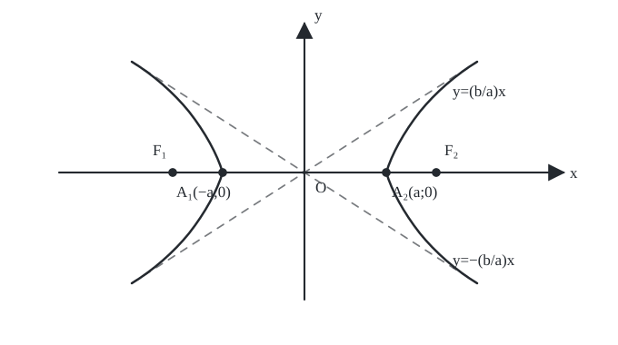
</p>

<p align="center"><em>Канонический чертёж гиперболы</em></p>


[↑ К содержанию](#содержание)

---

<a id="ticket-19"></a>

## Билет 19. Каноническое уравнение параболы.

### Определения из полной тетради

**Определение 1.** Параболой называется геометрическое место точек плоскости, равноудалённых от данной прямой, называемой директрисой, и данной точки, не лежащей на директрисе, называемой фокусом.

**Определение 2.** Уравнение $y^2=2px$ называется **каноническим уравнением параболы**; система координат $xOy$, в условиях теоремы 1, называется канонической системой координат для данной параболы.

### Теорема 1 (о каноническом уравнении параболы)

При некотором выборе системы координат $xOy$ уравнение параболы принимает следующий вид:


```math
y^2=2px,\qquad p>0.
```


**Док-во:**


<p align="center">
  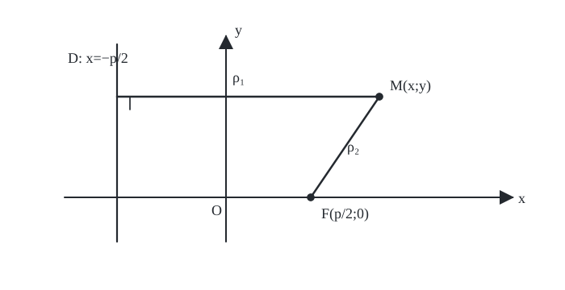
</p>

<p align="center"><em>Парабола, фокус и директриса</em></p>


```math
\rho_1=\rho_2:\qquad \left|x+\frac p2\right|=\sqrt{\left(x-\frac p2\right)^2+y^2}.
```


```math
\begin{aligned}
\left(x+\frac p2\right)^2&=\left(x-\frac p2\right)^2+y^2,\\
x^2+px+\frac{p^2}{4}&=x^2-px+\frac{p^2}{4}+y^2,\\
y^2&=2px.
\end{aligned}
```


Так как при возведении в квадрат могли появиться посторонние решения, проверим:


```math
\sqrt{\left(x-\frac p2\right)^2+y^2}
=\sqrt{x^2-px+\frac{p^2}{4}+2px}
=\sqrt{\left(x+\frac p2\right)^2}
=\left|x+\frac p2\right|.\quad\blacksquare
```


> **Чертёж.** Точка $O(0;0)$ называется вершиной параболы; прямая $y=0$ называется осью параболы.


<p align="center">
  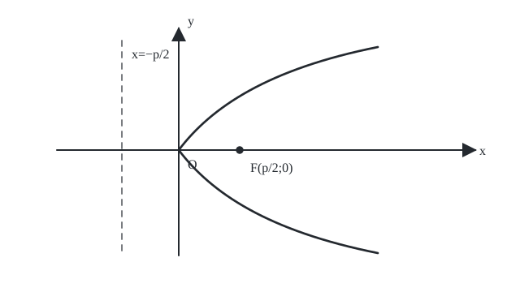
</p>

<p align="center"><em>Канонический чертёж параболы</em></p>


[↑ К содержанию](#содержание)

---

<a id="ticket-20"></a>

## Билет 20. Аксиомы линейного пространства и непосредственные следствия из них.

### Определения из полной тетради

**Определение 1.** Линейным пространством над числовым полем $P$ называется множество $V\ne\varnothing$, на котором определены операции «+» и «·» на число из $P$, удовлетворяющие следующим требованиям (аксиомам линейного пространства).

Элементы $V$ называются векторами данного линейного пространства; множество $V$ называется носителем данного линейного пространства.

### Определение 1. Аксиомы линейного пространства

1. $\forall\vec x,\vec y\in V\quad \vec x+\vec y=\vec y+\vec x$.
2. $\forall\vec x,\vec y,\vec z\in V\quad (\vec x+\vec y)+\vec z=\vec x+(\vec y+\vec z)$.
3. $\exists\vec0\in V\ \forall\vec x\in V\quad \vec x+\vec0=\vec x$.
4. $\forall\vec x\in V\ \exists(-\vec x)\in V\quad \vec x+(-\vec x)=\vec0$.
5. $\forall\alpha\in P\ \forall\vec x,\vec y\in V\quad \alpha(\vec x+\vec y)=\alpha\vec x+\alpha\vec y$.
6. $\forall\alpha,\beta\in P\ \forall\vec x\in V\quad (\alpha+\beta)\vec x=\alpha\vec x+\beta\vec x$.
7. $\forall\alpha,\beta\in P\ \forall\vec x\in V\quad \alpha(\beta\vec x)=(\alpha\beta)\vec x$.
8. $\forall\vec x\in V\quad 1\cdot\vec x=\vec x$.

### Следствия из аксиом линейного пространства

1. $\vec0$ — единственный нулевой вектор линейного пространства.
2. $-\vec x$ — единственный вектор, противоположный $\vec x$.
3. $0\cdot\vec x=\vec0$.
4. $(-1)\vec x=-\vec x$.
5. $\alpha\cdot\vec0=\vec0$.

**Док-во:**

**1)** Пусть $\vec0_1$ и $\vec0_2$ — нулевые векторы линейного пространства $V$. Тогда


```math
\vec0_1=\vec0_1+\vec0_2=\vec0_2.
```


**2)** Пусть $(-\vec x)_1$ и $(-\vec x)_2$ — векторы, обратные к $\vec x$ по сложению.


```math
\vec x+(-\vec x)_1=\vec0,\qquad \vec x+(-\vec x)_2=\vec0.
```


```math
((-\vec x)_2+\vec x)+(-\vec x)_1=(-\vec x)_2+\vec0
\Longrightarrow (-\vec x)_1=(-\vec x)_2.
```


**3)**


```math
0\cdot\vec x+\vec x=0\cdot\vec x+1\cdot\vec x=(0+1)\vec x=1\vec x=\vec x.
```


```math
0\cdot\vec x+\vec0=\vec x+(-\vec x)\Longrightarrow 0\cdot\vec x=\vec0.
```


**4)**


```math
\vec x+(-1)\vec x=1\vec x+(-1)\vec x=(1+(-1))\vec x=0\vec x=\vec0,
```


следовательно, $(-1)\vec x=-\vec x$.

**5)** Выберем $\vec x\in V$. Тогда


```math
\alpha\vec0=\alpha(0\vec x)=(\alpha\cdot0)\vec x=0\vec x=\vec0.\quad\blacksquare
```


[↑ К содержанию](#содержание)

---

<a id="ticket-21"></a>

## Билет 21. Теорема о преобразовании координат. Связь матриц перехода.

### Определения из полной тетради

**Определение 1.** Упорядоченная система векторов из $V$, $(\vec e_1,\vec e_2,\ldots,\vec e_n)$, называется **базисом** $V$, если она линейно независима и каждый вектор $\vec x\in V$ представим в виде $\vec x=\alpha_1\vec e_1+\cdots+\alpha_n\vec e_n$.

Числа $\alpha_1,\ldots,\alpha_n$ называются **координатами** вектора $\vec x$ в данном базисе; столбец координат обозначается $[\vec x]_{Б}$.

**Определение 2.** Пусть $Б=(\vec e_1,\ldots,\vec e_n)$ и $Б'=(\vec e'_1,\ldots,\vec e'_n)$ — базисы линейного пространства $V$. Матрицей перехода из базиса $Б$ в базис $Б'$ называется матрица $T_{Б\to Б'}$, любой $j$-й столбец которой равен $[\vec e'_j]_{Б}$.

### Теорема 1 (о преобразовании координат)

Пусть $Б$ и $Б'$ — базисы конечномерного линейного пространства $V$. Тогда для любого $\vec x\in V$


```math
[\vec x]_{Б}=T_{Б\to Б'}\,[\vec x]_{Б'}.
```


**Док-во:**


```math
\vec e'_j=\sum_{i=1}^n t_{ij}\vec e_i.
```


Пусть


```math
[\vec x]_{Б'}=\begin{pmatrix}x'_1\\x'_2\\\vdots\\x'_n\end{pmatrix},\qquad
[\vec x]_{Б}=\begin{pmatrix}x_1\\x_2\\\vdots\\x_n\end{pmatrix}.
```


```math
\begin{aligned}
\vec x&=x_1\vec e_1+x_2\vec e_2+\ldots+x_n\vec e_n,\\
\vec x&=x'_1\vec e'_1+x'_2\vec e'_2+\ldots+x'_n\vec e'_n\\
&=x'_1(t_{11}\vec e_1+t_{21}\vec e_2+\ldots+t_{n1}\vec e_n)+\ldots\\
&\quad+x'_n(t_{1n}\vec e_1+t_{2n}\vec e_2+\ldots+t_{nn}\vec e_n)\\
&=(t_{11}x'_1+t_{12}x'_2+\ldots+t_{1n}x'_n)\vec e_1+\ldots\\
&\quad+(t_{n1}x'_1+t_{n2}x'_2+\ldots+t_{nn}x'_n)\vec e_n.
\end{aligned}
```


Следовательно,


```math
\begin{cases}
x_1=t_{11}x'_1+t_{12}x'_2+\ldots+t_{1n}x'_n,\\
x_2=t_{21}x'_1+t_{22}x'_2+\ldots+t_{2n}x'_n,\\
\ \vdots\\
x_n=t_{n1}x'_1+t_{n2}x'_2+\ldots+t_{nn}x'_n.
\end{cases}
```


```math
[\vec x]_{Б}=T_{Б\to Б'}[\vec x]_{Б'}.\quad\blacksquare
```


### Теорема 2

Пусть $Б,Б',Б''$ — базисы $V$. Тогда


```math
T_{Б\to Б''}=T_{Б\to Б'}\,T_{Б'\to Б''}.
```


**Док-во:** пусть $T_{Б\to Б''}=(t''_{ij})$, $T_{Б\to Б'}=(t'_{ij})$, $T_{Б'\to Б''}=(t^{\prime\prime\prime}_{ij})$. Для $\vec e''_j$:


```math
\begin{aligned}
\vec e''_j&=t^{\prime\prime\prime}_{1j}\vec e'_1+t^{\prime\prime\prime}_{2j}\vec e'_2+\ldots+t^{\prime\prime\prime}_{nj}\vec e'_n\\
&=t^{\prime\prime\prime}_{1j}(t'_{11}\vec e_1+t'_{21}\vec e_2+\ldots+t'_{n1}\vec e_n)+\ldots\\
&\quad+t^{\prime\prime\prime}_{nj}(t'_{1n}\vec e_1+t'_{2n}\vec e_2+\ldots+t'_{nn}\vec e_n).
\end{aligned}
```


Отсюда


```math
t''_{ij}=t'_{i1}t^{\prime\prime\prime}_{1j}+t'_{i2}t^{\prime\prime\prime}_{2j}+\ldots+t'_{in}t^{\prime\prime\prime}_{nj},
```


то есть $T_{Б\to Б''}=T_{Б\to Б'}T_{Б'\to Б''}$. $\blacksquare$

### Следствие


```math
T_{Б\to Б'}=T_{Б'\to Б}^{-1}.
```


**Док-во:**


```math
T_{Б\to Б}=E_{n\times n},\qquad T_{Б\to Б'}T_{Б'\to Б}=E\Longrightarrow T_{Б'\to Б}=T_{Б\to Б'}^{-1}.\quad\blacksquare
```


[↑ К содержанию](#содержание)

---

<a id="ticket-22"></a>

## Билет 22. Критерий подпространства. Свойства линейных оболочек.

### Определения из полной тетради

**Определение 1.** Непустое подмножество $L$ линейного пространства $V$ называется **подпространством** $V$, если $\forall\vec x,\vec y\in L$ выполняется $\vec x+\vec y\in L$ и $\forall\vec x\in L\ \forall\alpha\in P$ выполняется $\alpha\vec x\in L$. Обозначение: $L\le V$.

**Определение 2.** Линейной оболочкой системы векторов $\vec x_1,\vec x_2,\ldots,\vec x_m$ называется множество их линейных комбинаций. Обозначение: $\langle\vec x_1,\vec x_2,\ldots,\vec x_m\rangle$.

**Базис.** Упорядоченная линейно независимая система векторов, через которую единственным образом выражается каждый вектор рассматриваемого линейного пространства.

### Теорема 1 (критерий подпространства)

Пусть $V$ — линейное пространство над полем $P$, $L\subseteq V$, $L\ne\varnothing$. Тогда


```math
L\le V\Longleftrightarrow \forall\vec x,\vec y\in L\ \forall\alpha,\beta\in P\quad (\alpha\vec x+\beta\vec y)\in L.
```


**Док-во:**

**$\Rightarrow$** Пусть $L\le V$, $\vec x,\vec y\in L$, $\alpha,\beta\in P$. Тогда $\alpha\vec x\in L$ и $\beta\vec y\in L$, следовательно $\alpha\vec x+\beta\vec y\in L$.
**$\Leftarrow$** Пусть $\forall\vec x,\vec y\in L\ \forall\alpha,\beta\in P$ выполняется $(\alpha\vec x+\beta\vec y)\in L$. При $\alpha=\beta=1$ получаем $\vec x+\vec y\in L$. Пусть $\vec x\in L$, $\alpha\in P$; выберем любой $\vec y\in L$, $\beta=0$. Тогда $\alpha\vec x=\alpha\vec x+0\vec y\in L$. Следовательно, $L\le V$. $\blacksquare$
> **Следствие.** $L\le V\Longleftrightarrow$ вместе с любыми $\vec x_1,\ldots,\vec x_m\in L$ любая их линейная комбинация также принадлежит $L$.

### Теорема 2 (о линейных оболочках)

1. Линейная оболочка любой системы векторов — подпространство.
2. Если $\vec x_1,\vec x_2,\ldots,\vec x_m$ — линейно независимая система, то $(\vec x_1,\vec x_2,\ldots,\vec x_m)$ — базис $\langle\vec x_1,\vec x_2,\ldots,\vec x_m\rangle$.

**Док-во:**

**1)** Пусть $\vec y,\vec z\in\langle\vec x_1,\ldots,\vec x_m\rangle$, $\alpha,\delta\in P$. Тогда


```math
\vec y=\beta_1\vec x_1+\ldots+\beta_m\vec x_m,\qquad \vec z=\gamma_1\vec x_1+\ldots+\gamma_m\vec x_m.
```


```math
\alpha\vec y+\delta\vec z=(\alpha\beta_1+\delta\gamma_1)\vec x_1+\ldots+(\alpha\beta_m+\delta\gamma_m)\vec x_m\in\langle\vec x_1,\ldots,\vec x_m\rangle.
```


По критерию подпространства $\langle\vec x_1,\ldots,\vec x_m\rangle\le V$.

**2)** Любой вектор из $\langle\vec x_1,\ldots,\vec x_m\rangle$ является линейной комбинацией $\vec x_1,\ldots,\vec x_m$; если данная система линейно независима, то по определению базиса $(\vec x_1,\ldots,\vec x_m)$ — базис этой линейной оболочки. $\blacksquare$


[↑ К содержанию](#содержание)

---

<a id="ticket-23"></a>

## Билет 23. Сумма и пересечение подпространств. Критерий прямой суммы.

### Определения из полной тетради

**Определение 1.** Суммой подпространств $L\le V$ и $M\le V$ называется множество


```math
L+M=\{\vec x+\vec y:\ \vec x\in L,\ \vec y\in M\}.
```


Эта сумма называется **прямой** и обозначается $L\oplus M$, если $L\cap M=\{\vec0\}$.

**Пересечение** $L\cap M$ — множество векторов, одновременно принадлежащих $L$ и $M$.

### Теорема 1

Пусть $L\le V$ и $M\le V$. Тогда


```math
L\cap M\le V\qquad\text{и}\qquad L+M\le V.
```


**Док-во:**

**1)** Пусть $\vec x,\vec y\in L\cap M$, $\alpha,\beta\in P$. Так как $\vec x,\vec y\in L$, то $\alpha\vec x+\beta\vec y\in L$. Так как $\vec x,\vec y\in M$, то $\alpha\vec x+\beta\vec y\in M$. Следовательно, $\alpha\vec x+\beta\vec y\in L\cap M$, поэтому $L\cap M\le V$.
**2)** Пусть $\vec x,\vec y\in L+M$, $\alpha,\beta\in P$. Тогда существуют $\vec x_1,\vec y_1\in L$ и $\vec x_2,\vec y_2\in M$, такие что


```math
\vec x=\vec x_1+\vec x_2,
\qquad \vec y=\vec y_1+\vec y_2.
```


```math
\alpha\vec x+\beta\vec y=\underbrace{\alpha\vec x_1+\beta\vec y_1}_{\in L}+\underbrace{\alpha\vec x_2+\beta\vec y_2}_{\in M}\in L+M.
```


Следовательно, $L+M\le V$. $\blacksquare$

### Теорема 2 (критерий прямой суммы)

Пусть $L\le V$ и $M\le V$. Тогда


```math
L+M=L\oplus M\Longleftrightarrow \forall\vec z\in L+M\ \exists!\vec x\in L\ \exists!\vec y\in M:\ \vec z=\vec x+\vec y.
```


**Док-во:**

**$\Rightarrow$** Пусть $L+M=L\oplus M$. Тогда $L\cap M=\{\vec0\}$. Пусть


```math
\vec z=\vec x_1+\vec y_1=\vec x_2+\vec y_2,\qquad \vec x_1,\vec x_2\in L,\ \vec y_1,\vec y_2\in M.
```


Тогда $\vec x_2-\vec x_1=\vec y_1-\vec y_2$. Левая часть принадлежит $L$, правая — $M$, значит этот вектор принадлежит $L\cap M=\{\vec0\}$. Следовательно, $\vec x_1=\vec x_2$ и $\vec y_1=\vec y_2$: разложение единственно.

**$\Leftarrow$** Пусть каждый $\vec z\in L+M$ имеет единственное представление $\vec z=\vec x+\vec y$, $\vec x\in L$, $\vec y\in M$. Допустим, $\vec z\in L\cap M$. Тогда


```math
\vec z=\vec z+\vec0=\vec0+\vec z.
```


В силу единственности разложения $\vec z=\vec0$, поэтому $L\cap M=\{\vec0\}$, то есть $L+M=L\oplus M$. $\blacksquare$

> **Основная теорема.** $L+M=L\oplus M\Longleftrightarrow L\cap M=\{\vec0\}$.


[↑ К содержанию](#содержание)

---

<a id="ticket-24"></a>

## Билет 24. Теорема о размерности суммы.

### Определения из полной тетради

**Базис** линейного пространства — упорядоченная линейно независимая система векторов, через которую единственным образом выражается каждый вектор пространства.

**Размерность** конечномерного линейного пространства — число векторов в его базисе; обозначается $\dim V$.

**Сумма подпространств:** $L+M=\{\vec x+\vec y:\vec x\in L,\vec y\in M\}$.

### Теорема 1 (о размерности суммы)

Пусть $V$ — конечномерное линейное пространство, $L\le V$ и $M\le V$. Тогда


```math
\dim(L+M)=\dim L+\dim M-\dim(L\cap M).
```


**Док-во:** пусть $(\vec e_1,\vec e_2,\ldots,\vec e_k)$ — базис $L\cap M$. Дополним эту систему векторов до базиса $L$:


```math
(\vec e_1,\ldots,\vec e_k,\vec f_1,\vec f_2,\ldots,\vec f_l).
```


Дополним ту же самую систему до базиса $M$:


```math
(\vec e_1,\ldots,\vec e_k,\vec g_1,\vec g_2,\ldots,\vec g_m).
```


Покажем, что


```math
(\vec e_1,\ldots,\vec e_k,\vec f_1,\ldots,\vec f_l,\vec g_1,\ldots,\vec g_m)
```


— базис $L+M$.

Пусть $\vec z\in L+M$. Тогда существуют $\vec x\in L$ и $\vec y\in M$, такие что $\vec z=\vec x+\vec y$. Представим $\vec x$ и $\vec y$ в базисах $L$ и $M$. Тогда $\vec z$ представляется в виде линейной комбинации $\vec e_i,\vec f_j,\vec g_s$. Следовательно, эта система порождает $L+M$.

Пусть


```math
\alpha_1\vec e_1+\ldots+\alpha_k\vec e_k+
\beta_1\vec f_1+\ldots+\beta_l\vec f_l+
\gamma_1\vec g_1+\ldots+\gamma_m\vec g_m=\vec0.
```


Тогда


```math
\underbrace{\alpha_1\vec e_1+\ldots+\alpha_k\vec e_k+
\beta_1\vec f_1+\ldots+\beta_l\vec f_l}_{\in L}
=-
\underbrace{\left(\gamma_1\vec g_1+\ldots+\gamma_m\vec g_m\right)}_{\in M}.
```


Правая часть принадлежит $L\cap M$, поэтому существуют $\delta_1,\ldots,\delta_k$, для которых


```math
-
\gamma_1\vec g_1-\ldots-\gamma_m\vec g_m=
\delta_1\vec e_1+\delta_2\vec e_2+\ldots+\delta_k\vec e_k.
```


Следовательно,


```math
\delta_1\vec e_1+\ldots+\delta_k\vec e_k+
\gamma_1\vec g_1+\ldots+\gamma_m\vec g_m=\vec0.
```


Так как $(\vec e_1,\ldots,\vec e_k,\vec g_1,\ldots,\vec g_m)$ — базис $M$, имеем $\delta_1=\ldots=\delta_k=\gamma_1=\ldots=\gamma_m=0$. Тогда из исходного равенства и линейной независимости базиса $L$ получаем $\alpha_1=\ldots=\alpha_k=\beta_1=\ldots=\beta_l=0$. Значит, построенная система линейно независима и является базисом $L+M$.


```math
\dim(L+M)=k+l+m=(k+l)+(k+m)-k
=\dim L+\dim M-\dim(L\cap M).\quad\blacksquare
```


> **Следствие.** $\dim(L\oplus M)=\dim L+\dim M$, так как $\dim\{\vec0\}=0$.


---

[↑ К содержанию](#содержание)

